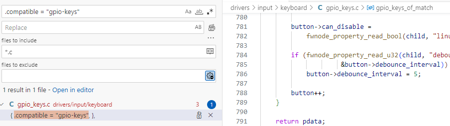
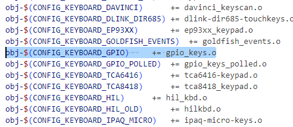
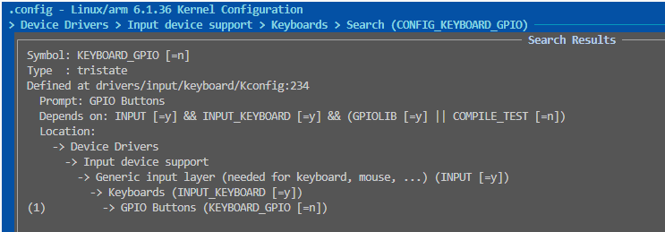

# 驱动问题和功能实现整理

本系列所有问题都会指定芯片和系统版本，不同芯片和系统处理可能不一致，只能进行参考。

- [TTY Serial支持带控制引脚的RS485通讯方式(I.MX6ULL, Linux6.1)](#question-001)
- [芯片支持双网卡模式(I.MX6ULL, Linux6.1)](#question-002)
- [解决网口报错问题: "Master/Slave resolution failed, maybe conflicting manual settings"(I.MX6ull, Linux6.1)](#question-003)
- [硬件在U-Boot中指定I/O上电默认输出的电平(I.MX6ULL, Linux6.1)](#question-004)
- [在设备树中查询到某节点，状态为okay，且内核自带驱动，如何确定开启配置方法(all)](#question-005)
- [pinctrl报错复用被占用如何处理(I.MX6ULL, Linux6.1)](#question-006)
- [spi支持不同位数的通讯，如8bit, 16bit, 32bit(T113_i, Linux5.4)](#question-007)
- [linux串口接收二进制字符0x11，0x13, 0x0d等特殊字符串丢弃和转换，如何处理](#question-008)
- [linux驱动中引脚如何支持应用中切换引脚复用功能(如支持gpio不同复用功能)](#question-009)

## question-001

问题: TTY Serial支持带控制引脚的RS485通讯方式。

```c
// 设备树增加tty支持
&uart4 {
    //...
    rts-gpios = <&gpio1 18 GPIO_ACTIVE_LOW>;    //rs458和rts引脚配合使用，rts-gpio对应控制引脚
    rs485-rts-delay = <2 2>;                    //设置rs485切换延时
    linux,rs485-enabled-at-boot-time;           //开启rs485标志位
};

//应用层控制
#include <asm-generic/ioctls.h>

//应用层配置rs485模式
int rs485_enable(const int fd, const RS485_ENABLE_t enable)
{
    struct serial_rs485 rs485conf;
    int res;

    //read config
    res = ioctl(fd, TIOCGRS485, &rs485conf);
    if (res < 0) {
        perror("Ioctl error on getting 485 configure:");
        close(fd);
        return res;
    }

    if (enable) {   // Enable rs485 mode
        rs485conf.flags |= SER_RS485_ENABLED;
    } else {        // Disable rs485 mode
        rs485conf.flags &= ~(SER_RS485_ENABLED);
    }

    rs485conf.delay_rts_before_send = 4;

    //write config
    res = ioctl(fd, TIOCSRS485, &rs485conf);
    if (res < 0) {
        perror("Ioctl error on setting 485 configure:");
        close(fd);
    }

    return res;
}
```

## question-002

问题: I.MX6ull支持双网口模式.

修改双网口主要是设备树里面支持双网口的实现。

```shell
# 设备树支持双网口
&fec1 {
    pinctrl-names = "default";
    pinctrl-0 = <&pinctrl_enet1
        &pinctrl_fec1_reset>;
    phy-mode = "rmii";
    phy-handle = <&ethphy0>;
    phy-reset-gpios = <&gpio5 7 GPIO_ACTIVE_LOW>;
    phy-reset-duration = <26>;
    phy-supply = <&reg_peri_3v3>;
    status = "okay";
};

&fec2 {
    pinctrl-names = "default";
    pinctrl-0 = <&pinctrl_enet2
                &pinctrl_fec2_reset>;
    phy-mode = "rmii";
    phy-handle = <&ethphy1>;
    phy-supply = <&reg_peri_3v3>;
    phy-reset-gpios = <&gpio5 8 GPIO_ACTIVE_LOW>;
    phy-reset-duration = <26>;
    status = "okay";

    mdio {
        #address-cells = <1>;
        #size-cells = <0>;

        ethphy0: ethernet-phy@0 {
            compatible = "ethernet-phy-id0022.1560";
            reg = <0>;
            micrel,led-mode = <1>;
            clocks = <&clks IMX6UL_CLK_ENET_REF>;
            clock-names = "rmii-ref";

        };

        ethphy1: ethernet-phy@1 {
            compatible = "ethernet-phy-id0022.1560";
            reg = <1>;
            micrel,led-mode = <1>;
            clocks = <&clks IMX6UL_CLK_ENET2_REF>;
            clock-names = "rmii-ref";
        };
    };
};

# 系统使能eth1
ifconfig eth1 192.168.2.100 netmask 255.255.255.0
ifconfig eth1 up
```

## question-003

问题: **I.MX6ull解决网口报错问题**

```shell
[   28.685938] Micrel KSZ8081 or KSZ8091 20b4000.ethernet-1:00: attached PHY driver (mii_bus:phy_addr=20b4000.ethernet-1:00, irq=POLL)
[   30.805784] Micrel KSZ8081 or KSZ8091 20b4000.ethernet-1:00: Master/Slave resolution failed, maybe conflicting manual settings?
[   30.817336] ------------[ cut here ]------------
[   30.821962] WARNING: CPU: 0 PID: 24 at drivers/net/phy/phy.c:1013 phy_state_machine+0x9c/0x29c
[   30.830660] Modules linked in:
[   30.833735] CPU: 0 PID: 24 Comm: kworker/0:2 Not tainted 6.1.36 #11
[   30.840013] Hardware name: Freescale i.MX6 Ultralite (Device Tree)
[   30.846202] Workqueue: events_power_efficient phy_state_machine
[   30.852162]  unwind_backtrace from show_stack+0x10/0x14
[   30.857413]  show_stack from dump_stack_lvl+0x40/0x4c
[   30.862485]  dump_stack_lvl from __warn+0x90/0xbc
[   30.867213]  __warn from warn_slowpath_fmt+0xbc/0x1b8
[   30.872287]  warn_slowpath_fmt from phy_state_machine+0x9c/0x29c
[   30.878322]  phy_state_machine from process_one_work+0x1c4/0x3d0
[   30.884357]  process_one_work from worker_thread+0x50/0x50c
[   30.889949]  worker_thread from kthread+0xec/0x11c
[   30.894763]  kthread from ret_from_fork+0x14/0x2c
[   30.899491] Exception stack(0xa08e1fb0 to 0xa08e1ff8)
[   30.904554] 1fa0:                                     00000000 00000000 00000000 00000000
[   30.912741] 1fc0: 00000000 00000000 00000000 00000000 00000000 00000000 00000000 00000000
[   30.920927] 1fe0: 00000000 00000000 00000000 00000000 00000013 00000000
[   30.927600] ---[ end trace 0000000000000000 ]---
//....
```

修改方法:

```c
//位置: drivres/net/phy/phy_device.c中的phy_probe函数
//注释如下代码

    //not read 1000M register to avoid phy issue.
#if 0
    if (linkmode_test_bit(ETHTOOL_LINK_MODE_1000baseT_Half_BIT,
                    phydev->supported))
        phydev->is_gigabit_capable = 1;
    if (linkmode_test_bit(ETHTOOL_LINK_MODE_1000baseT_Full_BIT,
                    phydev->supported))
        phydev->is_gigabit_capable = 1;
#endif
```

## question-004

问题: **硬件在U-Boot中指定I/O上电默认输出的电平**。

上电默认电平可以在U-Boot中修改，路径为board/freescale/mx6ullevk/mx6ullevk.c中(如果移植u-boot,放置在指定位置)

```c
int setup_led(void)
{
    //请求LED，设置LED电平
    gpio_request(IMX_GPIO_NR(1, 3), "led shows"); 
    gpio_direction_output(IMX_GPIO_NR(1, 3), 0);

    return 0;
}

int board_late_init(void)
{
#ifdef CONFIG_CMD_BMODE
    add_board_boot_modes(board_boot_modes);
#endif

    env_set("tee", "no");
#ifdef CONFIG_IMX_OPTEE
    env_set("tee", "yes");
#endif

#ifdef CONFIG_ENV_VARS_UBOOT_RUNTIME_CONFIG
    env_set("board_name", "EVK");

    if (is_mx6ull_9x9_evk())
        env_set("board_rev", "9X9");
    else
        env_set("board_rev", "14X14");

    if (is_cpu_type(MXC_CPU_MX6ULZ)) {
        env_set("board_name", "ULZ-EVK");
        env_set("usb_net_cmd", "usb start");
    }
#endif

    setup_lcd();

    setup_led();

#ifdef CONFIG_ENV_IS_IN_MMC
    board_late_mmc_env_init();
#endif

    set_wdog_reset((struct wdog_regs *)WDOG1_BASE_ADDR);

    return 0;
}
```

## question-005

问题: **在设备树中查询到某节点，状态为okay，且内核自带驱动，如何确定开启配置方法。**

这里以key-gpios为例，节点名称如下。

```c
gpio_keys: gpio_keys@0 {
    compatible = "gpio-keys";
    pinctrl-names = "default";
    pinctrl-0 = <&pinctrl_gpio_keys>;
    #address-cells = <1>;
    #size-cells = <0>;
    autorepeat;

    key1@1 {
        label = "USER-KEY1";
        linux,code = <114>;
        gpios = <&gpio1 18 GPIO_ACTIVE_LOW>;
        gpio-key,wakeup;
    };
};
```

第一步，全局检索compatible对应的字符串，查找到驱动地址，确定为drivers/input/keyboard/gpio-keys.c



第二步，查询同目录下的Makefile文件，确定该文件被包含需要满足的条件，确定为宏**CONFIG_KEYBOARD_GPIO**



第三步, 在menuconfig菜单中检索CONFIG_KEYBOARD_GPIO，查找路径并置位。可以看到路径如下所示。

Device Driver > Input device support > Generic input layer > Keyboards > GPIO buttons



修改保存后，查看内核根目录下是否有CONFIG_KEYBOARD_GPIO，如果存在则表示设置成功。

## question-006

问题: pinctrl复用被占用如何处理

pinctrl复用被占用一般发生在设备树添加某个模块时，其gpio和设备树中已有的I/O功能冲突，此时注释掉原pinctrl中引脚即可。


可以看到gpio-keys0中增加的pinctrl与原2190000.mmc冲突(对应usdhc1接口)，注释掉相应的pinctrl，并关闭模块即可。

```c
usdhc1: mmc@2190000 {
    compatible = "fsl,imx6ul-usdhc", "fsl,imx6sx-usdhc";
    //......
};

&usdhc1 {
    // pinctrl-names = "default", "state_100mhz", "state_200mhz";   //注释掉对应的pinctrl
    // pinctrl-0 = <&pinctrl_usdhc1>;
    // pinctrl-1 = <&pinctrl_usdhc1_100mhz>;
    // pinctrl-2 = <&pinctrl_usdhc1_200mhz>;
    cd-gpios = <&gpio1 19 GPIO_ACTIVE_LOW>;
    keep-power-in-suspend;
    wakeup-source;
    vmmc-supply = <&reg_sd1_vmmc>;
    status = "disabled";                                           //关闭usdhc1模块
};
```

## question-007

spi支持不同位数的通讯，如8bit, 16bit, 32bit(T113_i, Linux5.4)。

```c
// ================ spi设备驱动文件kernel_bus_spi.c ===============
// 配置spi的位数， 这里以支持32bit为例
struct spi_device *spi;

//1.初始化spi接口
spi = (struct spi_device *)chip->private_data;
spi->bits_per_word = 32;
spi->mode = SPI_MODE_0;

spi_setup(spi);

// ================ spi总线驱动文件 ===================
// 文件: drivers/spi/spi-sunxi.c
// 函数: static int sunxi_spi_probe(struct platform_device *pdev)
- master->bits_per_word_mask = SPI_BPW_MASK(8);
+ master->bits_per_word_mask = SPI_BPW_RANGE_MASK(1, 32);
// 配置硬件寄存器，支持相应的位数，此方法修改后，spi只支持指定位数访问，如果spi挂载多个器件，可能访问其它器件不正常。
// 函数: static int sunxi_spi_xfer_setup(struct spi_device *spi, struct spi_transfer *t)
if (spi->bits_per_word) {
    spi_bit_transfer_configure(spi->bits_per_word, base_addr);
}

static void spi_bit_transfer_configure(u8 bit_per_word, void __iomem *base_addr)
{
    unsigned int rval = 0xA0;

    rval |= bit_per_word<<16;
    rval |= bit_per_word<<8;
    rval |= 0x11;

    writel(rval, base_addr + SPI_BACC_REG);
}
```

## question-008

Linux串口接收二进制字符0x11，0x13, 0x0d等特殊字符串丢弃和转换，如何处理

一般linux串口编程中，对c_iflag（termios成员变量）这个变量都没有进行有效的设置。在传送ASCII码时没什么问题，但在传送二进制数据时遇到0x0d、0x11和0x13却会被丢掉，通过配置c_iflag可以解决

```c
// 关闭输入的CR转换为NL - 0x0d
// 关闭起动/停止输出控制流起作用 - 0x11 0x13
term.c_cflag |= CLOCAL | CREAD;
term.c_lflag &= ~(ICANON | ECHO | ECHOE | ISIG);
term.c_oflag &= ~OPOST;
term.c_iflag &= ~(BRKINT | ICRNL | INPCK | ISTRIP | IXON);
```

## question-009

linux驱动中引脚如何支持应用中切换引脚复用功能(如支持gpio不同复用功能)，可以实现类似正常情况作为通讯引脚，休眠或者挂起模式作为输入引脚降低功耗或者实现其它特殊需求。

驱动支持引脚复用功能，通过pinctrl框架可以实现，包含设备树，驱动中共同实现。

```c
//设备树说明
&iomuxc {
    //...
    pinctrl_gpio_led: gpio-leds {
        fsl,pins = <
            MX6UL_PAD_GPIO1_IO03__GPIO1_IO03        0x17059         //引脚复用功能1
        >;
    };

    pinctrl_led_improve: led-improve {
        fsl,pins = <
            MX6UL_PAD_GPIO1_IO03__GPIO1_IO03        0x40017059      //引脚复用功能2
        >;
    };
};

gpiosgrp {
    compatible = "simple-bus";
    //...

    usr_led {
        //...
        pinctrl-names = "default", "improve";   //复用功能别名，用于驱动中根据名称访问
        pinctrl-0 = <&pinctrl_gpio_led>;        //对应第一种复用功能
        pinctrl-1 = <&pinctrl_led_improve>;     //对应第二种复用功能
    };
};

//驱动中添加处理
//获取"pinctrl-x"属性
chip->led_pinctrl = devm_pinctrl_get(&pdev->dev);
if (IS_ERR_OR_NULL(chip->led_pinctrl)) {
    dev_info(&pdev->dev, "[devm_pinctrl_get]failed\n");
    return -EIO;
}
chip->pinctrl_state[0] = pinctrl_lookup_state(chip->led_pinctrl, "default");
if (IS_ERR_OR_NULL(chip->pinctrl_state[0])) {
    dev_info(&pdev->dev, "[pinctrl_lookup_state]read default failed!\n");
    return -EIO;
}
chip->pinctrl_state[1] = pinctrl_lookup_state(chip->led_pinctrl, "improve");
if (IS_ERR_OR_NULL(chip->pinctrl_state[1])) {
    dev_info(&pdev->dev, "[pinctrl_lookup_state]read improve failed:%d!\n", IS_ERR_OR_NULL(chip->pinctrl_state[1]));
    return -EIO;
}

//创建设备管理文件/sys/devices/platform/20c406c.usr_led/info
//cat info (status=1)
//echo 0 > info #选择配置0
//echo 1 > info #选择配置1
chip->led_attr.attr.name = "info";
chip->led_attr.attr.mode = 0666;
chip->led_attr.show = led_show;
chip->led_attr.store = led_store;
ret = device_create_file(&pdev->dev, &chip->led_attr);
if (ret != 0) {
    dev_info(&pdev->dev, "device create file failed!\n");
    goto exit_device_create;
}

//获取引脚的当前配置信息
static ssize_t led_show(struct device *dev, struct device_attribute *attr, char *buf)
{
    int size, index;
    static struct led_data *chip;
    u32 regval[5] = {0};
    void *__iomem io_reg;

    for (index=0; index<5; index++) {
        io_reg = of_iomap(dev->of_node, index);
        if (io_reg != NULL) {
            regval[index] = readl(io_reg);
        }
    }
    chip = container_of(attr, struct led_data, led_attr);
    size = snprintf(buf, PAGE_SIZE, 
                    "LED_STATUS = %d\n"
                    "CCM_CCGR1 = 0x%08x\n"
                    "SW_MUX_GPIO1_IO03 = 0x%08x\n"
                    "SW_PAD_GPIO1_IO03 = 0x%08x\n"
                    "GPIO_DR = 0x%08x\n"
                    "GPIO_GDIR = 0x%08x\n", 
                    gpiod_get_value(chip->led_desc), regval[0], regval[1], regval[2], regval[3], regval[4]);

    return size;
}

//修改引脚的pinctrl配置信息
static ssize_t led_store(struct device *dev, struct device_attribute *attr,  const char *buf, size_t count)
{
    static struct led_data *chip;
    struct platform_device *pdev;
    u32 regval;

    chip = container_of(attr, struct led_data, led_attr);
    pdev = chip->pdev;

    if (0 == memcmp(buf, "0", 1)) {
        pinctrl_select_state(chip->led_pinctrl, chip->pinctrl_state[0]);
        dev_info(&pdev->dev, "led pinctrl 0!\n");
    } else if (0 == memcmp(buf, "1", 1)) {
        pinctrl_select_state(chip->led_pinctrl, chip->pinctrl_state[1]);
        dev_info(&pdev->dev, "led pinctrl 1!\n");
    }
    else {
        dev_info(&pdev->dev, "led store issue!\n");
    }

    regval = readl(chip->io_reg);
    dev_info(&pdev->dev, "regval:0x%x!\n", regval);
    return count;
}
```

## next_chapter

[返回目录](../README.md)

直接开始下一节说明: [应用设计说明](./ch04-00.application_design.md)
