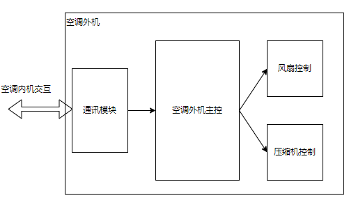

# 应用设计说明

嵌入式开发技术总体来说是一门应用于产品的技术，无论是u-boot, 内核，文件系统，驱动，包括应用都只是系统构成的一部分。嵌入式设备可以通过检测一系列外部行为，实现具体的服务。换句话说，嵌入式系统的产品开发可以说是为了实现从数据输入(包含不限于传感器，串口，网络等)到输出(输出不限于GUI，网络，机械运动，继电器通断)的过程。

在应用开发时，根据产品的需求，去分析产品输入和输出接口，这样可以更清晰的理解应用开发，如果在学习中带着这种思想，也更容易理解在做什么，为什么这么做。基于数据流动的思想去理解嵌入式产品开发，有些抽象，不过这里举个日常生活中的产品例子来帮助理解。本篇中以大家比较熟悉得空调产品为例，来分析如何从嵌入式角度，来开发完整产品；不过本人并未从事过空调相关产品研发，只能从使用者的角度来进行分析，如有错误，欢迎大家留言。

对于空调产品，应该比较熟悉，有以下几部分组成。

1. 遥控器，用于控制空调的工作模式，温度，风速，定时休眠等
2. 空调内机，支持遥控器和本身控制面板操作，智能空调还支持手机端通过APP操作，或者其它终端语音控制。
3. 空调外机，主要包含压缩机和风扇模块，风扇用于散热，压缩机则通过调压/调频等方式，高效的控制空调的运行

按照这个思路，整个产品的框架如下所示。

可以看到，一个完整的智能空调系统由手机端APP，云服务器，语音控制设备(智能音箱，电视机等)，遥控器，空调内机，空调外机等组成。其中遥控器，空调内/外机就是和嵌入式开发相关的内容，我们进一步解析这些模块的实现。

## remote-device

遥控器就是常见的电子设备，产品功能比较单一。例如空调遥控器的目的就是实现空调的控温和工作模式，不过这只是需求，我们需要实现什么功能，下面就需要按照产品设计的角度去分析遥控器的工作模式。遥控器需要哪些功能？

- 按键输入，遥控器通过按键选择工作模式（制冷、制热、通风）、风速、温度控制、定时开关、辅热等
- 红外控制输出，将按键信息转换为红外信号，通过红外发射器控制空调功能
- 界面UI输出，需要显示当前工作模式，风速、定时等信息

当然上面只是设计的功能，那么对于产品就要进一步的去对应到硬件和功能上。

1. 按键输入, 根据遥控器支持的具体功能，如开关机，温度调节，工作模式调节，风速调节，定时模式等，需要多个I/O的实现，这时就需要类似5x5矩阵键盘的设计来节省I/O
2. 红外控制信号输出，传统空调通过红外信号通讯，支持通讯协议，因此要通过硬件实现红外协议的发送支持
3. 屏幕输出，选择不同接口(SPI, I2C或并口屏), 实现屏幕输出，并能够根据当前状态控制UI显示

可以看到整个框架比较简单，基于这个结构，就可以进行嵌入式软件的梳理。不过这里有个隐藏的开发经验内容，那就是遥控器是电池供电，且需要待机允许长时间工作(一年以上)，还要能够工作，这就需要极低的待机功耗。因此需要遥控器主控支持低功耗待机，这里面其实是有方法计算的。

两节7号电池的容量在1000~1200mAh，如果希望待机一年以上，则待机功耗需要小于：电池容量/365/24 = 114uA，也就是保证整机功耗小于100uA即可满足要求。这就需要主控芯片支持低功耗，例如STM32L0系列，另外需要支持休眠唤醒，低功耗时钟等。

基于上述功能需求和框架设计，嵌入式软件的主要实现内容如下所示。

- 按键I/O检测，按键扫描驱动实现和事件触发，单独按钮低功耗唤醒支持
  - 按键扫描的逻辑实现，获取指定按键
  - 将按键转换为事件，后续进行处理
- 按键事件触发对于红外命令发送命令的支持和图形重绘
  - 事件触发红外命令的执行
  - 事件触发图形显示的重绘
- 红外通讯命令协议实现
  - 红外编解码模块控制
  - 红外命令组包和发送控制
- UI界面实现，控制接口实现
  - 屏幕驱动支持(SPI/I2C/并口协议)
  - 界面UI绘制，字符库和图形显示，遥控器界面比较简单，一般使用自绘图形和精简字库的模式来控制成本
- 低功耗模式支持
  - 支持休眠模式，支持按键唤醒，支持低功耗时钟等

上述内容即实现遥控器的全部嵌入式软件开发，主要以单片机开发为主，在大循环中实现，包含按键扫描模块，红外发送模块，UI绘制模块，以及事件处理逻辑，在配合底层硬件驱动实现全部功能，整体上并不困难。下面开始进行空调外机功能的说明。

## air_conditioner_outer

空调外机，也就是我们平时看到的外面转着风扇，轰轰直响的箱子，其从功能上描述，可以说并不复杂，就包括以下部分。

1. 接收空调内机的控制信息，解析处理
2. 控制压缩机，高效的控制空调的运行
3. 根据需要控制风扇的转速，满足系统运行的工况
4. 返回运行工作状态，告知空调内机反馈和处理

整个模型清晰，看起来并不复杂，如果以框架显示大致如下所示。

可以看到，空调外机的功能，就是将空调内机的控制信息如设置温度，风扇转速等要求告知控制外机，并根据这些信息执行对压缩机和风扇的动作。

你可能感觉框架简单，并没有多少模块，不过这部分其实才是整个空调产品的核心功能，这里讲下为啥这么重要。

空调的最终目的是什么？其实很清晰，就是实现温度的调节，再往上就是对于调温效率、功率、噪音、使用寿命、价格有要求。如果空调不能满足温度，或者调温效率太低(例如封闭环境下一个小时和目标温度还差10几度，制冷和制热做不到)，那么这款空调就没有任何价值。如果耗电一天几十度，噪音起飞，那么也不会有人购买。而这几个指标，其实是相互矛盾的，在压缩机技术未革命性提升的情况下，调温效率越高，功率就需要越大，噪音也会更高，那么如何平衡这些指标，在成本可控的情况下，实现让客户满意的效果，就是空调产品的核心竞争力了。空调外机的开发需要结构，硬件、软件和成本的综合考虑，硬件上选择更优秀的压缩机和控制主板，结构上设计更好的风道和交换管路，往往有更大的提升，不过往往也预示着更高的成本。当然软件算法的优化也一定程度可以降低噪音和功率，不过除非硬件和结构差距很小，不然很难弥补。

空调外机的嵌入式软件的主要开发内容就如下所示。

- 通讯模块，可以是can，rs485等
  - 实现数据接收和发送功能
  - 协议解析和数据包组合，添加对应处理
- 压缩机和风扇控制模块，根据温度、噪音、功耗等需求，处理控制逻辑算法
- 信息采集，获取风扇，压缩机信息，返回到空调内机进行处理和展示

可以看到，空调外机可以使用单片机或者dsp作为主控，然后通过串口或can接口与空调内机进行通讯，然后根据空调内机的控制信息，控制压缩机和风扇。这一部分看似不复杂，却涉及到行业中专用的压缩机开发和调试功能。压缩机的驱动板和驱动控制算法，是空调使用功能和性能的基础，也是最核心的部分。不过因为本人没有从事过空调行业，这里就不多赘述，只是根据经验描述下这部分的开发方法，具体深入就只能在行业中去了解。

## air_conditioner_inner

空调内机是整个系统的中枢，是数据中转的中心。遥控器的控制信息，其它云端服务的请求，都需要空调内机进行接受和处理后，最终告知空调外机实现控制策略。空调内机虽然不是系统的核心功能，却是产品用户体验中重要的一环。

空调内机和外机比起来是直接面向终端消费者、app云端控制、语音控制、实时信息反馈、丰富的可调项可以大幅度优化用户体验。虽然这部分并不核心，但是UI界面，面板控制，红外接收解析处理，组网和云端控制，云端同步推送这些功能的实现，却很容易提升产品的价值，在压缩机性能满足基本需求后，这部分就是很大的加分项，毕竟用过语音控制的空调，肯定再也不想返回还需要找遥控器的时代。

从嵌入式软件方法来说，这部分也是系统最繁杂的部分，具体包含如下内容。

1. 接收红外模块信息，解析处理
2. 接受面板控制信息，解析处理
3. 实现组网，作为客户端访问云端服务器，获取指令和提交状态
4. UI界面实现，根据内部状态修改显示(温度，风速，工作状态等)
5. 与空调外机通讯，通知温度设置信息，并获取外机反馈信息
6. 控制空调内机的的其它器件，如空调舱门和内部扇片

按照上述功能需求，空调内机的模块组件可以解析如下所示。

空调内机的功能看起来就复杂很多，不过有着物联网产品开发框架的经验来说，就会发现其实大同小异，都可以采用相同的框架接口来实现。

1. 红外模块解析处理，这部分一般使用通用的红外转串口模块，直接读取信息转换为串口数据，解析协议即可。
2. 控制面板主要按键就开关机、模式切换、温度加/减、风速条件等，转换成相应的事件处理
3. 组网功能，基于WIFI实现的网络客户端模式，这种一般使用mqtt客户端模式或者自定义服务，两种我都实践过，不过对于这种定期提交数据的方式，mqtt简化了大量操作，实践会比自己开发简单
4. UI界面实现，空调的UI因为基本不切换，也可以使用自绘图，或者开源的UI界面如LVGL
5. 与外机通讯一般基于安全可靠的通讯协议，如Modbus或者自定义协议
6. 本机的其它硬件主要涉及保护电路控制，安全检测，控制舱门开关，以及风向的摇摆等

按照软件功能的模块划分，可以分为红外串口解析模块、按键扫描模块、wifi通讯管理和mqtt组网模块、UI界面刷新模块、外机通讯控制模块、以及系统状态监控和硬件控制模块，最终统一到系统工作流中，实现完整的空调内机功能。

## summary

空调是我们在日常中最常见的产品，看起来并不复杂；但是从开发角度，仍然需要设计三套设备的通讯交互，控制。涉及到按键扫描，LCD驱动开发和UI开发，压缩机变频控制，红外发送和红外接收解析，主从机通讯协议设计开发，WIFI通讯连接和MQTT组网服务，以及配套的硬件设计和安全包含机制等。

整个系统的构建可以说涉及物联网设备的各方面知识，也有行业特殊的功能需求。单纯的学习芯片的驱动，或者实现应用demo，和开发集成这些功能的难度其实是跨越性的，没有工作经验很难去思考这些问题。这也是需要转变思维的原因，嵌入式不只是要学习多少知识点，还要能够应用知识点，在遇到产品时，有着分解问题，转变为软件需求，并能够进行设计开发的能力。另外在学习本系列文章时，也要有着这种思维，要以需求为导向去了解知识，这也是嵌入式学习的最佳指引路线。

本篇的内容也只是我按照自己经验分析的思路，当然会有错漏之处，如果有不同意见，可以反馈告知；有则改之无则加勉，才能共同进步。

## next_chapter

[返回目录](../README.md)

直接开始下一节说明: [c语言基础语法](./ch04-01.cpp_grammar.md)
