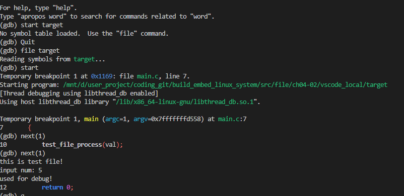
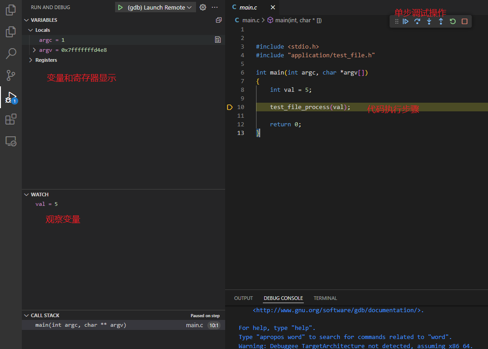
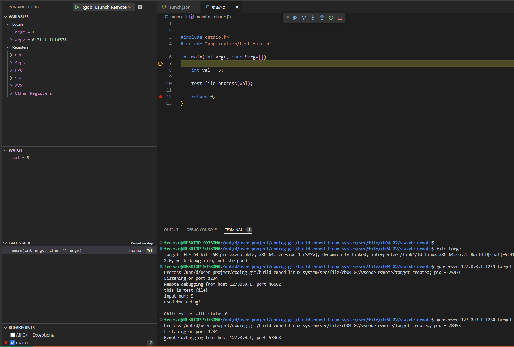

# 应用调试方法

嵌入式Linux平台的应用调试方法主要是通过使用printf，write或cout将信息输出到控制台，查看执行流是否符合预期。对于复杂应用，通常也会封装成logger接口，实现调试信息打印和权限控制。不过这种打印需要实现大量的冗余代码，而且也没有单片机那种单步调试的方式灵活且直观，其实嵌入式Linux平台也支持类似单片机的使用gdb远程调试方案，本节将进行详细说明。目录说明如下所示。

- [使用gdb+vscode进行系统调试](#gdb_debug)
  - [linux平台gdb使用方法](#gdb_linux_used)
  - [gdb配置vscode实现本地调试](#gdb_local_vscode)
  - [gdb使用远程调试交叉编译环境](#gdb_remote_vscode)
  - [gdb交叉编译执行问题解决](#gdb_cross_fix)

## gdb_debug

GDB（GNU Debugger）是一个强大的、灵活的调试工具，用于调试C、C++和Fortran等编程语言编写的程序。它是GNU项目的一部分，并且是许多Linux发行版和其他Unix-like操作系统中默认包含的调试器。GDB允许程序员在程序运行时监视其内部状态和行为，包括查看变量的值、执行逐步跟踪、设置断点等。对于GDB的应用，支持在本平台使用GDB单步/断点调试，也支持通过gdbserver支持跨平台进行远程调试。使用GDB命令调试并不直观，因此这里使用vscode+gdb进行本地调试，vscode+gdbserver的方式进行远程联调，本节中将分两个部分进行说明。

### gdb_linux_used

GDB进行调试需要编译的文件带有调试信息，因此编译中需要使用标签: "-g"。判断编译好的二进制文件是否支持gdb可通过简单方法测试，这里以生成文件target进行测试。

```shell
# 进入gdb调试界面
gdb

# 读取文件
file target

# 设置输入参数(argc, argv)
set args 1 2

# 启动程序到main入口
start

# 单步调试
next(1)

# 查看当前变量的值 
info locals

# 离开调试
q
```

具体流程如下所示。



可以看到单步执行的结果，内部变量的值以及帧栈信息。不过这种显示不直观，vscode提供了图形化的操作，可以更简单的方式进行单步调试和运行，这里进行说明。vscode支持gdb调试其实比较简单，只需要实现相应配置文件，启动调试就可以，下节进行说明。

### gdb_local_vscode

vscode支持gdb编译主要基于配置文件.vscode/launch.json，指定调试的gdb工具和文件，内容如下。

```json
{
    "version": "0.2.0",
    "configurations": [
        {
            "name": "(gdb) Launch Remote",
            "type": "cppdbg",
            "request": "launch",
            "args": [], 
            "cwd": "${workspaceFolder}",
            "stopAtEntry": true,
            "program": "${workspaceFolder}/target",     //具体的项目文件，编译的可执行文件
            "setupCommands": [
                { 
                    "text": "-enable-pretty-printing", 
                    "description": "Enable GDB pretty printing", 
                    "ignoreFailures": true 
                }
            ],
            "preLaunchTask": "build",                   //指定调试前执行的任务，查看tasks中的build变量(不希望重新编译，可以删除)
            "miDebuggerPath": "gdb",                    //指定调试工具，本地用gdb, 跨平台用对应的调试器
        }
    ]
}
```

另外，如果希望调试前执行其它的任务，如重新编译项目，就需要.vscode/tasks.json的支持。这里使用make命令，使用目录下的Makefile完成编译，然后进行调试。如果只是希望调试，注释上面的preLaunchTask，下面的文件也可以不实现。.vscode/tasks.json具体内容如下。

```json
{
    "tasks": [
        {
            "label": "build",        //任务名称，其它任务请求使用
            "type": "shell",         //任务类型，shell表示执行命令行语句
            "command": "make",       //执行make命令
            "args": [
                "-j2",               //执行make命令附带参数，make -j2
            ],
            "group": {
                "kind": "build",
                "isDefault": true
            },
            "problemMatcher": "$gcc",   //问题匹配器，异常指定输出gcc相关的问题
            "detail": "Task generated by Debugger."
        }
    ],
    "version": "2.0.0"
}
```

此时使用F5或者Run > Start Debugging即可执行文件。



在调试界面下常用快捷键。

- F5：全速执行
- F10：跳过语句执行，不进入函数执行下一步
- F11：进入语句执行，进入函数执行下一步
- Shift+F11：跳出当前函数执行
- Ctrl+Shift+F5: 重新执行
- Shift+F5：结束执行

相关实现参考路径：[vscode本地调试方法](./file/ch04-02/vscode_local/)，需要将此目录位于vscode的顶层目录，且在Linux环境下才能执行。

### gdb_remote_vscode

对于交叉编译环境，和gdb有些差别，需要使用gdbserver绑定端口使用，其它操作类似。

- 嵌入式端支持gdbserver应用

以buildroot为例，增加编译选项

```shell
# xxx_defconfig
# GDB Support
BR2_PACKAGE_GDB_ARCH_SUPPORTS=y
BR2_PACKAGE_GDB=y
BR2_PACKAGE_GDB_SERVER=y
```

- 嵌入式端启动gdbserver应用

```shell
# 使用gdbserver启动应用
gdbserver [ipaddress]:[port] execute

# 举例说明
gdbserver 127.0.0.1:1234 target
```

执行成功如下所示。


- 使用gdb远程连接gdbserver进行调试，这一步配合vscode使用，配置文件修改.vscode/launch.json，具体内容如下所示。

```json
{
    "version": "0.2.0",
    "configurations": [
        {
            "name": "(gdb) Launch Remote",
            "type": "cppdbg",
            "request": "launch",
            "args": ["1", "2"],                 //定义输入的变量，args列表
            "cwd": "${workspaceFolder}",
            "stopAtEntry": true,
            "program": "${workspaceFolder}/target",
            "setupCommands": [
                { 
                    "text": "-enable-pretty-printing", 
                    "description": "Enable GDB pretty printing", 
                    "ignoreFailures": true 
                }
            ],
            //"preLaunchTask": "build", //指定调试前执行的任务，查看tasks中的build变量(交叉编译执行时，gdbserver由服务端重启，不建议重新编译)
            "miDebuggerPath": "arm-none-linux-gnueabihf-gdb",   //指定调试工具，本地用gdb, 跨平台用对应的调试器
            "miDebuggerServerAddress": "192.168.2.99:1234",        //指定gdbserver连接端口，用于配合gdbserver调试
        }
    ]
}
```

如果连接成功，远程访问的显示和本地的方式基本一致，具体显示如下所示。



### gdb_cross_fix

gdb交叉编译访问时，主要问题是arm-linux-xxx-gdb启动过程中显示缺少相应库。

- 缺少libncursesw.so.5和libtinfo.so.5库

ln -sf /usr/lib/x86_64-linux-gnu/libncursesw.so.6 /usr/lib/x86_64-linux-gnu/libncursesw.so.5
ln -sf /usr/lib/x86_64-linux-gnu/libtinfo.so.6 /usr/lib/x86_64-linux-gnu/libtinfo.so.5

- 缺少libpython3.6m.so.1.0库

下载，编译和安装python3.6, 方法如下。

```shell
wget -c https://www.python.org/ftp/python/3.6.15/Python-3.6.15.tar.xz
tar -xvf Python-3.6.15.tar.xz
cd Python-3.6.15/

LDFLAGS="-L/usr/lib/x86_64-linux-gnu" ./configure --enable-shared
make -j10
sudo make install

sudo ldconfig
```

更新库即可。

## 使用coredump进行crash分析

## 常用调试工具和接口

## next_chapter

[返回目录](../README.md)

直接开始下一节说明: [Linux平台QT界面开发](./ch04-03.gui_qt_design.md)
