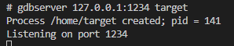

# Linux平台调试工具(gdb)

嵌入式Linux平台的应用调试方法主要是通过printf，write或cout将信息输出到控制台，查看执行流是否符合预期。对于复杂应用，通常也会封装成logger接口，实现调试信息打印和权限控制。不过这种打印需要实现大量的冗余代码，也没有单片机那种单步调试的方式灵活且直观。其实嵌入式Linux平台也支持类似单片机的使用gdb进行远程调试，本节将进行详细说明，如下所示。

- [使用gdb+vscode进行系统调试](#gdb_debug)
  - [linux平台gdb使用方法](#gdb_linux_used)
  - [gdb配置vscode实现本地调试](#gdb_local_vscode)
  - [arm-xxx-gdb使用远程调试交叉编译环境](#gdb_remote_vscode)
  - [arm-xxx-gdb执行异常问题解决](#gdb_cross_fix)
- [使用strace进行跟踪分析](#strace)
- [使用coredump进行crash分析](#coredump)
- [kdump原理及其使用方法](#kdump)

## gdb_debug

GDB（GNU Debugger）是一个强大的、灵活的调试工具，用于调试C、C++和Fortran等编程语言编写的程序。它是GNU项目的一部分，并且是许多Linux发行版和其他Unix-like操作系统中默认包含的调试器。GDB允许程序员在程序运行时监视其内部状态和行为，包括查看变量的值、执行逐步跟踪、设置断点等。对于GDB的应用，支持在本平台使用GDB单步/断点调试，也支持通过gdbserver支持跨平台进行远程调试。使用GDB命令调试并不直观，因此这里使用vscode+gdb进行本地调试，vscode+gdbserver的方式进行远程联调，本节中将分两个部分进行说明。

### gdb_linux_used

GDB进行调试需要编译的文件带有调试信息，因此编译中需要使用标签: "-g"。

```shell
# 编译添加-g选项
g++ -g main.cpp -o target
```

判断编译好的二进制文件是否支持gdb可通过简单方法测试，这里以生成文件target进行测试。

```shell
# 进入编译目录, 执行gdb界面
gdb

# 读取文件
file target

# 设置输入参数(argc, argv)
set args 1 2

# 启动程序到main入口
start

# 执行下一行代码，进入函数内部
step

# 执行下一行代码，不进入函数内部
next

# 查看变量值
print <变量名>

# 查看当前帧栈信息
backtrace

# 查看当前变量的值 
info locals

# 离开调试
q
```

具体流程如下所示。


可以看到单步执行的结果，内部变量的值以及帧栈信息。不过这种显示不直观，vscode提供了图形化的操作，可以更简单的方式进行单步调试和运行，将在下节进行说明。

### gdb_local_vscode

vscode支持gdb调试比较简单，只需要实现相应配置文件，在启动调试就可以。

- 在工程目录下新建.vscode目录，并创建launch.json文件用于编译

```shell
# 创建.vscode目录
mkdir .vscode

# 进入.vscode目录
cd .vscode

# 创建launch.json文件
touch launch.json
```

- 修改launch.json文件，支持项目调试

```json
{
    "version": "0.2.0",
    "configurations": [
        {
            "name": "(gdb) Launch Remote",
            "type": "cppdbg",
            "request": "launch",
            "args": [], 
            "cwd": "${workspaceFolder}",
            "stopAtEntry": true,
            "program": "${workspaceFolder}/target",     //具体的项目文件，编译的可执行文件
            "setupCommands": [
                { 
                    "text": "-enable-pretty-printing", 
                    "description": "Enable GDB pretty printing", 
                    "ignoreFailures": true 
                }
            ],
            //"preLaunchTask": "build",                     //指定调试前执行的任务，查看tasks中的build变量(不希望重新编译，可以删除)
            "miDebuggerPath": "gdb",                        //指定调试工具，本地用gdb, 跨平台用对应的调试器
        }
    ]
}
```

另外，如果希望调试前执行其它的任务，如重新编译项目，就需要.vscode/tasks.json的支持。这里使用make命令，使用目录下的Makefile完成编译，然后进行调试。如果只是希望调试，注释上面的preLaunchTask，下面的文件也可以不实现。.vscode/tasks.json具体内容如下。

```json
{
    "tasks": [
        {
            "label": "build",        //任务名称，其它任务请求使用
            "type": "shell",         //任务类型，shell表示执行命令行语句
            "command": "make",       //执行make命令
            "args": [
                "-j2",               //执行make命令附带参数，make -j2
            ],
            "group": {
                "kind": "build",
                "isDefault": true
            },
            "problemMatcher": "$gcc",   //问题匹配器，异常指定输出gcc相关的问题
            "detail": "Task generated by Debugger."
        }
    ],
    "version": "2.0.0"
}
```

此时使用**F5或者Run > Start Debugging**即可启动调试，参考显示如下所示。


在调试界面下常用快捷键。

- F5：全速执行
- F10：跳过语句执行，不进入函数执行下一步
- F11：进入语句执行，进入函数执行下一步
- Shift+F11：跳出当前函数执行
- Ctrl+Shift+F5: 重新执行
- Shift+F5：结束执行

相关实现参考路径：[vscode本地调试方法](./file/ch04-02/vscode_local_gdb/)。

注意：测试时需要vscode工作在wsl或者ssh远程连接Linux的状态下，调用Linux平台的gdb工具进行调试仿真。

### gdb_remote_vscode

对于交叉编译环境，和在本地调试有些区别。此时依赖gdbserver接口，实现本机的gdb与远程的应用进行调试，具体实现步骤如下所示

- 嵌入式端实现gdbserver应用

以buildroot系统为例，在编译文件系统时增加如下编译选项。

```shell
# xxx_defconfig
# GDB Support
BR2_PACKAGE_GDB_ARCH_SUPPORTS=y
BR2_PACKAGE_GDB=y
BR2_PACKAGE_GDB_SERVER=y
```

编译完成下载后，系统就可以支持gdbserver命令，用于进一步远程调试。

- 嵌入式端启动gdbserver应用

```shell
# 使用gdbserver启动应用
gdbserver [ipaddress]:[port] execute

# 举例说明
gdbserver 127.0.0.1:1234 target
```

执行成功如下所示。



- 使用gdb远程连接gdbserver进行调试，这一步配合vscode使用，配置文件修改.vscode/launch.json，具体内容如下所示。

```json
{
    "version": "0.2.0",
    "configurations": [
        {
            "name": "(gdb) Launch Remote",
            "type": "cppdbg",
            "request": "launch",
            "args": ["1", "2"],                 //定义输入的变量，args列表
            "cwd": "${workspaceFolder}",
            "stopAtEntry": true,
            "program": "${workspaceFolder}/target",
            "setupCommands": [
                { 
                    "text": "-enable-pretty-printing", 
                    "description": "Enable GDB pretty printing", 
                    "ignoreFailures": true 
                }
            ],
            //"preLaunchTask": "build", //指定调试前执行的任务，查看tasks中的build变量(交叉编译执行时，gdbserver由服务端重启，不建议重新编译)
            "miDebuggerPath": "arm-none-linux-gnueabihf-gdb",       //指定调试工具，本地用gdb, 跨平台用对应的调试器
            "miDebuggerServerAddress": "192.168.2.99:1234",         //指定gdbserver连接端口，用于配合gdbserver调试
        }
    ]
}
```

如果连接成功，远程访问的显示和本地的方式基本一致，具体显示如下所示。

相关实现参考路径：[vscode本地调试方法](./file/ch04-02/vscode_remote_gdb/)。


### gdb_cross_fix

测试中发现arm-linux-xxx-gdb启动过程中会显示缺少某些库，此时需要在PC端安装。

- 缺少libncursesw.so.5和libtinfo.so.5库

ln -sf /usr/lib/x86_64-linux-gnu/libncursesw.so.6 /usr/lib/x86_64-linux-gnu/libncursesw.so.5
ln -sf /usr/lib/x86_64-linux-gnu/libtinfo.so.6 /usr/lib/x86_64-linux-gnu/libtinfo.so.5

- 缺少libpython3.6m.so.1.0库

需要下载，编译和安装python3.6, 方法如下。

```shell
wget -c https://www.python.org/ftp/python/3.6.15/Python-3.6.15.tar.xz
tar -xvf Python-3.6.15.tar.xz
cd Python-3.6.15/

LDFLAGS="-L/usr/lib/x86_64-linux-gnu" ./configure --enable-shared
make -j10
sudo make install

sudo ldconfig
```

通过上述步骤更新相应的库即可满足工作要求。

## strace

strace是用于诊断、调试和跟踪Linux用户空间进程调用的系统调用和信号。它可以帮助你理解进程是如何与系统交互的，以及在这些交互过程中可能发生的错误。

基本用法:

```shell
strace [options] cmd [cmdargs]

## 常用选项
# -o <filename>：将输出重定向到文件，而不是标准输出。
# -p <pid>：附加到已经运行的进程（通过进程ID）。
# -f：跟踪子进程（fork 和 vfork）的系统调用。
# -e trace=<event>：只跟踪指定的系统调用或信号。例如，-e trace=open 只跟踪 open 调用。
# -e trace=!<event>：排除指定的系统调用或信号。例如，-e trace=!open 不跟踪 open 调用。
# -c：统计每个系统调用的调用次数、消耗的时间等。
#-t：在输出的每一行前加上时间戳。
# -T：显示每个系统调用的耗时。
```

实例用法:

- 跟踪一个命令的执行

```shell
strace ls
```

## coredump

程序在异常终止时，会触发对应的错误信号，此时操作系统会将程序的内存态内容包括程序内存、寄存器状态、调用栈等信息写入一个core文件。

异常终止原因根据对应信号主要分为如下几种：

- 段错误，触发信号 SIGSEGV包括访问空指针、数组越界、栈溢出等；
- 非法指令，触发信号SIGILL比如把一些随机数据当成指令执行：
- 浮点异常，触发信号 SIGFPE也就是除0操作；
- 非法内存访问，触发信号SIGMEM如访问已释放的内存；
- 总线错误，触发信号 SIGBUS比如收到异常的网络包等。

开启coredump的方法

```shell
ulimit -c unlimited；
```

对于某些设置了suid的程序如网卡抓包程序，在需要开启coredump时，需要修改 /etc/sysctl.conf 文件来启用。排查问题时，如果有core文件，使用gdb分析；否则使用dmesg分析内核日志。分析问题时，首先确认是否是OOM导致进程消失。grep xxx /var/log/messages 获取到程序crash的地址，然后使用ldd查看外部依赖库地址基址，使用objdump -d /lib64/libc-2.12.so --start-address=0x3ab9a7500 | head -n2000 | grep 75f62查找crash的系统调用。在排查问题时，coredump通常需要配合持久化日志综合分析。

## kdump

## next_chapter

[返回目录](../README.md)

直接开始下一节说明: [时间相关处理应用](./ch04-03.time_function.md)
