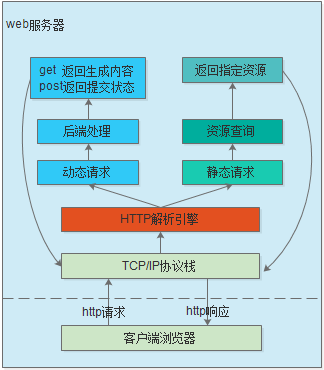

# 基于C++实现web服务器操作硬件

web服务器的实现在如今并不是一个困难的操作，使用python，nodejs，php等语言都可以快速实现web服务器，例如node中实现web服务器的代码可以精简如下。

```js
const http = require('http');

const port = 3000;

// 创建服务器
const server = http.createServer((req, res) => {
    if (req.url === '/') {
        res.writeHead(200, { 'Content-Type': 'text/plain; charset=utf-8' });
        res.end('这是主页！');
    } else if (req.url === '/about') {
        res.writeHead(200, { 'Content-Type': 'text/plain; charset=utf-8' });
        res.end('这是关于页面！');
    } else {
        res.writeHead(404, { 'Content-Type': 'text/plain; charset=utf-8' });
        res.end('404 - 未找到页面！');
    }
});

// 监听端口
server.listen(port, () => {
    console.log(`服务器正在监听端口 ${port}`);
});
```

就算是使用C/C++语言，也有很多成熟的web服务器框架可供使用，如boa，nginx，lighttpd等。不过实现支持静态读取和动态访问的服务器，可以了解linux socket应用开发和C++应用开发方法，以及理解HTTP协议，仍然是值得去实践的项目。

Web服务器作为资源的宿主，它需要处理用户端浏览器的请求，并指定对应的Web资源返回给用户，这些资源不仅包括HTML文件，JS脚本，JPG图片等，还包括由软件生成的动态内容。为了满足上述需求，一个简单的web服务器的实现流程如下所示。



1. 浏览器通过TCP/IP连接向服务器发送的http请求数据包。
2. http请求经过Web服务器的http解析引擎分析得出请求方法、资源地址等信息，然后开始处理。
3. 对于静态请求，则在服务器上查询请求url路径下文件，并返回(如果未找到则返回404 No Found)。
4. 涉及动态请求，如CGI， AJAX， ASP等，则根据http方法，采取不同处理。

按照浏览器访问和应答的流程，web服务器的实现也分为tcp服务器实现，tcp解析引脚，静态资源获取和动态资源处理，本章节将按照步骤进行实现。

本篇文章的配套代码。

- [web服务器代码实现](./file/ch04-07/http_server.hpp)。
- [应用实现代码](./file/ch04-07/main.cpp)

当然也可以参考我多年前写的文章：[TCP/IP协议学习(七) 基于C# Socket的Web服务器](https://www.cnblogs.com/zc110747/p/5131702.html#4496352)。

- [tcp服务器实现](#tcp_server)
- [http解析引擎](#http_parser_engine)
- [http静态资源处理](#http_static_process)
- [http动态资源处理](#http_dynamic_process)
- [下一章节](#next_chapter)

## tcp_server

tcp_server通过对TCP/IP协议进行封装，用于实现满足TCP通讯的API。在B/S架构中，服务器端的处理和C/S连接基本相同，主要工作包含：创建Socket套接字，监听连接，建立连接，获得请求，处理并返回数据，关闭连接等，对应到C++代码如下所示。

第一步，创建socket套接字，启动listen线程

```cpp
/// \brief start
/// - This method is used to start the object.
/// \param dynamic_process - dynamic process func.
/// \return Wheather initialization is success or failed.
bool start() 
{
    socket_fd_ = socket(PF_INET, SOCK_STREAM, 0);
    if (socket_fd_ < 0) {
        std::cout<<"socket init error!"<<std::endl;
        return false;
    }

    // 配置运行绑定在TIME_WAIT的接口
    int flag = 1;
    if (setsockopt(socket_fd_, SOL_SOCKET, SO_REUSEADDR, &flag, sizeof(flag)) == -1) {
        std::cout<<"setsockopt failed."<<std::endl;
        socket_fd_ = -1;
        return false;
    }

    // 启动线程
    std::thread(std::bind(&http_server::run, this)).join();

    return true;
}
```

第二步：监听socket通讯，建立连接成功后创建接收线程

```c
    void run()
    {
        struct sockaddr_in servaddr, clientaddr;

        // 绑定socket接口到指定的ip地址和端口(必须为本机IP或者127.0.0.1循环地址)
        memset(&servaddr, 0, sizeof(servaddr));    
        servaddr.sin_family = AF_INET;     
        servaddr.sin_addr.s_addr = inet_addr(ipaddr_.c_str());  
        servaddr.sin_port = htons(port_);

        do 
        {
            if (bind(socket_fd_, (struct sockaddr *)&servaddr, sizeof(servaddr)) < 0) {      
                std::cout<<"socket bind failed!"<<ipaddr_<<" "<<port_<<std::endl;
                sleep(5);
                continue;     
            } else {
                std::cout<<"socket bind ok, address "<<ipaddr_<<":"<<port_<<std::endl;
                break;  
            }
        }while(1);

        //监听socket通讯
        listen(socket_fd_, max_listen_);

        while (1) {
            int client_fd;
            uint32_t client_size; 

            client_size = sizeof(clientaddr);
            
            //等待客户端的TCP进行三次握手连接
            client_fd = accept(socket_fd_, (struct sockaddr *)&clientaddr, &client_size);
            if (client_fd < 0) {
                std::cout<<"socket accept failed!"<<std::endl;
                continue;
            } else {
                // 启动线程
                std::thread(std::bind(&http_server::recv_process_task, this, client_fd)).detach();
            }         
        }    
        close(socket_fd_);
    }
```

第三步：接收客户端请求，解析请求，处理请求，返回响应，关闭和客户端的连接

```c
/// \brief recv_process_task
/// - This method is for thread recv loop run.
/// \param fd - client fd.    
void recv_process_task(int fd) 
{
    char recvbuf[1024] = {0};
    int recv_len;
    http_engine engine([&](const char *ptr, int size){
        write(fd, ptr, size);
    });
    std::string out_str;

    memset(recvbuf, 0, sizeof(recvbuf));

    //接收客户端发送的数据
    recv_len = recv(fd, recvbuf, sizeof(recvbuf), 0);
    if (recv_len > 0) {  
        std::cout<<"recv len:"<<recv_len<<std::endl;
        recvbuf[recv_len] = '\0';
        
        if(engine.process(recvbuf, recv_len, dynamic_map_)) {
            std::cout<<"server callback ok"<<std::endl;
        }
    } else if (recv_len == 0) {
        std::cout<<"server recv zero, break!"<<std::endl;
    } else {
        std::cout<<"server recv failed, break!"<<std::endl;
    }

    close(fd);
}
```

tcp_sever通讯架构的实现和C/S结构没有什么区别，如果了解过，可以轻松实现基于tcp协议的socket通讯架构。下一步开始进行http解析引擎的实现。

## http_parser_engine

Web服务器主要实现对浏览器请求数据包的处理，并返回指定的http资源或者数据，这些都是由http解析引擎实现的。在写http解析引擎之前，我们要知晓接收到的数据，才能进行后续的处理，这里提供抓取的请求包格式。

```shell
# 请求报文
GET / HTTP/1.1      
Host: 172.27.83.254:8080
Connection: keep-alive
Upgrade-Insecure-Requests: 1
User-Agent: Mozilla/5.0 (Windows NT 10.0; Win64; x64) AppleWebKit/537.36 (KHTML, like Gecko) Chrome/132.0.0.0 Safari/537.36 Edg/132.0.0.0
Accept: text/html,application/xhtml+xml,application/xml;q=0.9,image/avif,image/webp,image/apng,*/*;q=0.8,application/signed-exchange;v=b3;q=0.7
Accept-Encoding: gzip, deflate
Accept-Language: zh-CN,zh;q=0.9,en;q=0.8,en-GB;q=0.7,en-US;q=0.6
```

参考<HTTP权威指南>的说明，HTTP报文包含以下三个部分。

1. 起始行，报文的第一行就是起始行，在请求报文中用来说明要做些什么，在响应报文中说明出现了什么情况
2. 首部字段，起始行后面有零个或多个首部字段。每个首部字段都包含一个名字和一个值，为了便于解析，两者之间用冒号（:）来分隔。
3. 主体，空行之后就是可选的报文主体了，其中包含了所有类型的数据。请求主体中包括了要发送给Web服务器的数据；响应主体中装载了要返回给客户端的数据

可以看到HTTP请求报文的内容很多，除了报文起始行外，首部部分说明如下。

1. Host指定来源的IP地址和端口
2. Connection指定连接状态
3. User-Agent指定客户端的应用程序信息，来自于的浏览器
4. Accept指定客户端可以接收的内容类型
5. Accept-Encoding指定支持的文件编码类型
6. Accept-Language指定支持的语言

当然这也只是请求端对于协议实现的一部分，对于完整的web服务器来说，要参考HTTP协议对所有字段都有相应的解析和处理手段。不过对于我们这种简单的web服务来说，我们只需要关注http报文的起始行就可以了。也就是"GET / HTTP/1.1"字段即可。

对于http报文起始行，内部以空格隔开，并以'\r\n'作为结尾与首部隔开。

- GET：HTTP方法
- '/' ：资源路径url
- HTTP/1.1:协议版本

HTTP协议的常见方法有GET, PUT, DELETE, POST, HEAD这5种，本节中的服务器主要涉及到GET/POST方法，当然理论上只支持GET也能实现所有功能。

了解了需要如何解析HTTP请求报文后，我们先定义一个HTTP报文解析结构，用于存储到解析的信息。局域网Web请求一般是通过ip+port的模式直接访问服务器端，所以第一个接收到的请求的url为'/'，这时我们需要将它映射到服务端定位的访问主页，目前设置为'/index.html'。同时这一步也同时解析了url的文件类型，会在后续构建响应报文使用，目前支持的文件类型有html，jpg，png，js，json等。

```cpp
typedef enum
{
    METHOD_GET = 0,
    METHOD_POST,
    METHOD_PUT,  
}HTTP_METHOD;

struct http_protocol
{
    /// \brief method_
    /// - the http method for http1.1.
    HTTP_METHOD method_;

    /// \brief method_
    /// - the url for user ask.   
    std::string url_;

    /// \brief ver_
    /// - the version for the http request.   
    std::string ver_;

    /// \brief is_dynamic
    /// - wheather the process is dynamic
    bool is_dynamic{false};

    /// \brief type_
    /// - file type
    HTTP_FILE_TYPE type_;
};
```

下面我们就要开始利用C++提供的string方法来截取http报文来实现http报文解析。

```cpp
/// \brief decode_request_line
/// - This method is used to decode the http header.
/// \param head_str - the substring data.
/// \return Wheather process success or failed.   
bool decode_request_line(const std::string &head_str)
{
    std::vector<std::string> tokens;
    std::istringstream tokenStream(head_str);
    std::string token;

    // 解析请求行
    while (tokenStream >> token) {
        tokens.push_back(token);
    }

    if (tokens.size() != 3) {
        std::cout<<"decode header failed!"<<std::endl;
        return false;
    }

    //获取方法，参考《HTTP权威指南》第三章
    //常见请求码GET，HEAD，POST，PUT，TRACE，OPTIONS，DELETE
    //这里只实现GET和POST
    if (tokens[0] == "GET") {
        protocol_.method_ = METHOD_GET;
    } else if (tokens[0] == "POST") {
        protocol_.method_ = METHOD_POST;
    } else {
        return false;
    }

    protocol_.url_ = tokens[1];
    if (protocol_.url_ == "/") {
        protocol_.url_ = "/index.html";
    }

    protocol_.ver_ = tokens[2];

    //解析文件后缀
    if (endsWith(protocol_.url_, ".json")) {
        protocol_.is_dynamic = true;
    } else {
        protocol_.is_dynamic = false;
        protocol_.type_ = FILE_TYPE_TEXT;

        for (const auto &file_type: resource_.file_type_list) {
            if(endsWith(protocol_.url_, file_type.first)) {
                protocol_.type_ = file_type.second;
                break;
            }
        }
    }

    return true;
}

// 解析http报文，进行进一步的动态和静态处理
bool process(char *rx_buffer, int rx_size, http_dynamic_map_type map={}) {
    int ret;

    std::string buffer(rx_buffer, rx_size);
    std::string sub_str("\r\n");
    std::cout<<buffer<<std::endl;

    tx_size_ = 0;

    //获取首部，查询字符串中的/r/n
    std::size_t pos = buffer.find(sub_str);
    std::string head_str = buffer.substr(0, pos);
    std::cout<<head_str<<std::endl;

    ret = decode_request_line(head_str);
    if (ret) {
        std::cout<<"method:"<<protocol_.method_<<std::endl;
        std::cout<<"url:"<<protocol_.url_<<std::endl;
        std::cout<<"ver:"<<protocol_.ver_<<std::endl;

        //动态执行引擎
        if (protocol_.is_dynamic) {
            std::size_t pos = buffer.find("\r\n\r\n");
            std::string data_str = buffer.substr(pos + 4);
            std::cout<<data_str<<std::endl;
            engine_dynamic_process(data_str, map);
        } else {
            //静态执行引擎
            if(!engine_static_process()) {
                html404_translate();              
            }
        }

    } else {
        html404_translate();
    }
    return true;           
}
```

下面就可以将解析后的数据进行处理，这里的处理分为静态和动态处理，静态处理就是直接读取文件并返回，动态处理就是通过ajax的格式返回给web端处理。

## http_static_process

静态web引擎的处理流程主要是读取文件长度和文件，构建响应头，响应首部和响应内容(文件)，通过发送接口提交到服务器，具体代码如下所示。

```cpp
/// \brief engine_static_process
/// - This method is used to static engine process. 
/// \return weather can find file  
bool engine_static_process()
{
    std::string url = "www" + protocol_.url_;
    std::ifstream input_file(url, std::ios::binary);
    char buffer[1024];

    if (!input_file) {
        std::cerr << "无法打开文件: " << url << std::endl;
        return false;
    }

    // 获取文件大小
    input_file.seekg(0, std::ios::end);
    std::streamsize body_size = input_file.tellg();
    input_file.seekg(0, std::ios::beg);

    // 发送响应头
    handle_tx_(resource_.http_resp_header_resource[HEAD_RESP_200].c_str(), resource_.http_resp_header_resource[HEAD_RESP_200].size());
    auto &&header_extra_str = format_header_extra_info(protocol_.type_, body_size);
    handle_tx_(header_extra_str.c_str(), header_extra_str.size());
    
    // 发送文件内容
    while (input_file) {
        input_file.read(buffer, 1024);
        std::streamsize bytesRead = input_file.gcount();

        if (bytesRead > 0) {
            handle_tx_(buffer, bytesRead);
        }

        if (input_file.bad()) {
            std::cerr << "读取文件时发生错误。" << std::endl;
            input_file.close();
            return 1;
        }

        if (input_file.eof() && bytesRead == 0) {
            break;
        }
    }

    // 关闭文件
    input_file.close();
    return true;            
}
```

文件打开成功后，我们就要生成http响应报文了，http响应报文和请求报文相同，也由三部分构成。

状态码:主要为客户端提供一种理解事务处理结果的便捷方式。主要实现的有:

- HTTP/1.1 200 OK 请求没有问题，实体的主体部分包含请求的资源
- HTTP/1.1 400 Bad Request 通知客户端它发送了一个错误的请求
- HTTP/1.1 401 Unauthorized 与适当的首部一同返回，通知客户端进行相应的认证
- HTTP/1.1 404 No Found 说明服务器无法找到请求的URL

响应首部:为客户端提供额外的关于服务器的消息，本项目中实现比较简单：

```shell
Content-type:CurrentType\r\n
Connection: close\r\n
Server:C++ Web\r\n
Content-Length:CurrentLength\r\n
\r\n\r\n

# body
```

其中Contenet-type需要根据我们上文获得的type类型来替换，这里阐述常见的替换规则。

| 类型 | 替换类型 |
| --- | --- |
| html | text/html;charset=utf-8 |
| jpg | application/x-jpg;charset=utf-8 |
| png | image/png;charset=utf-8 |
| js | application/x-javascript;charset=utf-8 |
| css | text/css;charset=utf-8 |

具体代码如下所示。

```cpp
/// 生成响应首部
/// \brief format_header_extra_info
/// - This method is used to format extra header info
/// \param type - file type.
/// \param size - file size.
/// \return string return for header
std::string format_header_extra_info(HTTP_FILE_TYPE type, int size)
{
    std::string base_string = "Content-type: ";

    switch ((type))
    {
    case FILE_TYPE_TEXT:
        base_string += "text/plain;charset=utf-8\r\n";
        break;
    
    case FILE_TYPE_JPG:
        base_string += "application/x-jpg;charset=utf-8\r\n";
        break;

    case FILE_TYPE_PNG:
        base_string += "image/png;charset=utf-8\r\n";
        break;

    case FILE_TYPE_HTML:
        base_string += "text/html;charset=utf-8\r\n";
        break;

    case FILE_TYPE_GIF:
        base_string += "image/gif;charset=utf-8\r\n";
        break;

    case FILE_TYPE_JS:
        base_string += "application/x-javascript;charset=utf-8\r\n";
        break;

    case FILE_TYPE_ASP:
        base_string += "text/asp;charset=utf-8\r\n";
        break;

    case FILE_TYPE_CSS:
        base_string += "text/css;charset=utf-8\r\n";
        break;

    case FILE_TYPE_JSON:
        base_string += "application/json;charset=utf-8\r\n";
        break;

    default:
        base_string += "text/html;charset=utf-8\r\n";   
        break;
    }

    base_string += "Connection: close\r\n";
    base_string += "Server: c++ sever\r\n";

    base_string += "Content-Length: ";
    base_string += std::to_string(size);
    base_string += "\r\n\r\n";

    return base_string;           
}
```

Content-Length字段是http响应报文正文的长度，即我们获得资源的总长度(上文中fslen), 最后将状态码，响应首部和正文数据整合在一起通过socket发送到客户端，就实现了静态服务器的全部过程。

## http_dynamic_process

动态服务器的实现主要是处理前端接收到的命令，执行相应的回调函数，并将结果返回给前端，最终更新显示到界面上。其中前端刷新和修改使用axios.js库，代码如下所示。

```js
<button @click="ledPushOn" class="button-spacing">LED_ON</button>
<button @click="ledPushOff" class="button-spacing">LED_OFF</button>

const app = Vue.createApp({
    data() {
        return {
            inputData: 'Hello World!',
            serverResponse: 'Hello World!'
        };
    },
    methods: {
        async submitData() {
            try {
                const response = await axios.post('submit.json', this.inputData);
                this.serverResponse = response.data;
            } catch (error) {
                console.error('Error submitting data:', error);
                this.serverResponse = 'Error submitting data';
            }
        },

        //led开灯事件提交
        async ledPushOn() {
            try {
                const response = await axios.post('led_push_on.json', this.inputData);
                console.log(response.data);
            } catch (error) {
                console.error('Error submitting data:', error);
            }
        },

        //led关灯事件提交
        async ledPushOff() {
            try {
                const response = await axios.post('led_push_off.json', this.inputData);
                console.log(response.data);
            } catch (error) {
                console.error('Error submitting data:', error);
            }
        }
    }
});
```

后端则是通过http动态引擎进行处理，这里我们主要实现了相应接口，如开灯、关灯。不过这里进行了封装，在用户层只需要注册对应的事件即可。

```cpp
using http_tx_func_type = std::function<void(const char *ptr, int size)>;
using http_dynamic_func_type = std::function<bool(const std::string& url, const std::string& data, std::string& response)>;
using http_dynamic_map_type = std::map<std::string, http_dynamic_func_type>;

// 动态事件的处理
/// \brief engine_static_process
/// - This method is used to dynamic engine process. 
/// \return the final for the process
bool engine_dynamic_process(const std::string &data_str, http_dynamic_map_type map={})
{
    std::string dynamic_rep;

    // 执行动态处理
    if (map.count(protocol_.url_))
    {
        auto dynamic_func = map[protocol_.url_];
        if (dynamic_func) {
            if(!dynamic_func(protocol_.url_, data_str, dynamic_rep)) {
                dynamic_rep = "dynamic process failed";
            }
        } else {
            dynamic_rep = "no support dynamic process";
        }
    } else {
        dynamic_rep = "404 Not Found";
    }

    handle_tx_(resource_.http_resp_header_resource[HEAD_RESP_200].c_str(), resource_.http_resp_header_resource[HEAD_RESP_200].size());

    auto &&header_extra_str = format_header_extra_info(FILE_TYPE_JSON, dynamic_rep.size());
    handle_tx_(header_extra_str.c_str(), header_extra_str.size());
    handle_tx_(dynamic_rep.c_str(), dynamic_rep.size());
    return true;
}
```

动态事件的命令和执行函数由应用自己实现，代码如下所示。

```cpp
#include <unistd.h>
#include <fcntl.h>
#include <mutex>
#include "http_server.hpp"

#define SERVER_IPADDR   "172.27.83.254"
#define SERVER_PORT     8080
#define LED_FILE_PATH   "/dev/led"

void led_process(int status);

std::map<std::string, HTTP_SREVER::http_dynamic_func_type> process_map = {
    {
        "/submit.json", [](const std::string& url, const std::string &data, std::string &response) {response = data; return true;},
    }
};

int main(int argc, char *argv[])
{
    HTTP_SREVER::http_server server;
    server.init(std::string(SERVER_IPADDR), SERVER_PORT, process_map);
    server.register_dynamic_process("/led_push_on.json", [](const std::string& url, const std::string &data, std::string &response) {
            led_process(1); 
            response="led on"; 
            return true;});
    server.register_dynamic_process("/led_push_off.json", [](const std::string& url, const std::string &data, std::string &response) {
            led_process(1); 
            response="led off";
            return true;}); 
    server.start();

    return 0;
}

static std::mutex led_mutex;
void led_process(int status)
{
    int fd;
    std::lock_guard<std::mutex> lock(led_mutex);

    fd = open(LED_FILE_PATH, O_RDWR);
    if(fd < 0) {
        printf("open %s failed\n", LED_FILE_PATH);
        return;
    }

    write(fd, &status, sizeof(status));
    close(fd);
}
```

至此，基于C++的web服务器就实现了。它包含静态网页，图片以及js，css文件的读取和前端基于axios的动态通讯实现。如果有一定的socket通讯知识基础以及对前后端知识的了解，整个实现过程并不复杂，不过相对于正常工作的web服务器，本例中的实现只能说是简单的框架，需要完善很多细节和功能，不过对于了解Linux应用开发和C++语法足够了。

## next_chapter

[返回目录](../README.md)

直接开始下一节说明: [fb图形界面操作应用](./ch04-08.fb_app.md)
