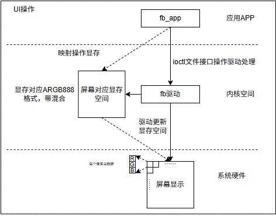
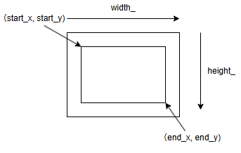
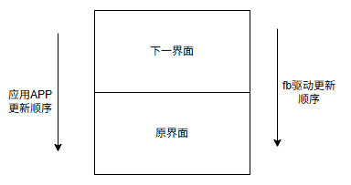
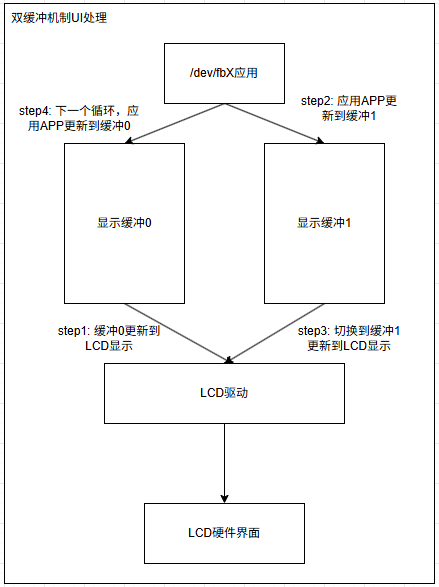
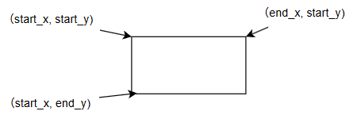

# fb图形界面操作应用

‌fbdev（framebuffer device）‌是Linux内核中的一个子系统，用于管理图形适配器的帧缓存区。它提供了一组API，使得用户空间程序可以直接访问和管理帧缓存区，从而控制屏幕的显示。对于嵌入式Linux来说，常见的QT、LVGL等图形库，其基础都是建立在对/dev/fbX的访问；因此理解fbdev的工作原理，对于分析UI显示问题，提高刷新率和帧率具有重要意义。

本章目录如下所示。

- [fb应用框架和接口](#fb_basic)
- [fb显存操作应用实现](#fb_signal)
- [fb双缓冲机制应用实现](#fb_double_cache)
- [fb图形框架实现](#fb_graphic)
  - [fb矩形图形实现](#fb_graphic_rect)
  - [fb字符界面实现](#fb_graphic_char)
- [总结](#summary)
- [下一章节](#next_chapter)

## fb_basic

在理解fbdev应用之前，先理解下图形显示的基本原理；这里不从复杂的MIPI，RGBLCD总线进行说明，而从逻辑上进行抽象。对于LCD屏幕来说，其组成如下。

1. 屏幕由一个个像素点组成
2. 每个像素点又由RGB(红、绿、蓝)三原色组成
3. 为了描述每个像素点的值，最基础的就是使用RGB来描述像素点的格式

对于图形显示来说，最基础的就是每个像素点都是8bit，这种格式就是RGB888；不过为了实现图形的遮蔽和透明效果，另外还定义透明度概念，由8bit实现，这种格式就是ARGB888；其长度占用4字节，是我们最常用的图形显示颜色。



可以看到，整个显示框架由三部分组成。

1. 屏幕显示硬件，通过mipi或者RGB接口连接SOC，支持通过写入数据更新图像。
2. 显示驱动，支持应用层管理刷新方式和获取状态信息，另外将显示映射的图像内容更新到真正的硬件上。
3. fb操作应用，也是本篇的重点，通过ioctl文件接口获取UI信息和控制UI操作动作，或者直接操作显存更新图像。

对于显示驱动和显示硬件，这个会在显示驱动章节：[图形显示FrameBuffer管理框架](./ch03-24.fb_frame.md)进行说明，这里主要进行操作应用的说明。

```c
// 打开设备文件，获得文件描述符
// open调用驱动中fops的open函数
int open(const char *pathname, int oflag,...);


// 映射显存到用户空间
// @addr: 映射的用户空间地址(可以自己选定用户空间地址用于映射)
// @length: 映射的长度
// @prot: 映射的保护权限(PROT_READ | PROT_WRITE、支持读写)
// @flags: 映射的标志位(MAP_SHARED，创建的内存映射允许进程间共享数据)
// @fd: 文件描述符(open打开的图形显示描述符)
// @offset: 偏移量
// @return: 映射后的用户空间地址
void *mmap(void *addr, size_t length, int prot, int flags, int fd, off_t offset);
/*
prot说明（多个组合):
PROT_EXEC - 页内容可以被执行
PROT_READ - 页内容可以被读取
PROT_WRITE - 页可以被写入
PROT_NONE - 页不可访问
flags说明:
MAP_FIXED - 使用指定的映射起始地址，如果由start和len参数指定的内存区重叠于现存的映射空间，重叠部分将会被丢弃。如果指定的起始地址不可用，操作将会失败。并且起始地址必须落在页的边界上。
MAP_SHARED - 与其它所有映射这个对象的进程共享映射空间。对共享区的写入，相当于输出到文件。直到msync()或者munmap()被调用，文件实际上不会被更新。
MAP_PRIVATE - 建立一个写入时拷贝的私有映射。内存区域的写入不会影响到原文件。这个标志和以上标志是互斥的，只能使用其中一个。
MAP_DENYWRITE - 这个标志被忽略。
MAP_EXECUTABLE - 同上
MAP_NORESERVE - 不要为这个映射保留交换空间。当交换空间被保留，对映射区修改的可能会得到保证。当交换空间不被保留，同时内存不足，对映射区的修改会引起段违例信号。
MAP_LOCKED - 锁定映射区的页面，从而防止页面被交换出内存。
MAP_GROWSDOWN - 用于堆栈，告诉内核VM系统，映射区可以向下扩展。
MAP_ANONYMOUS - 匿名映射，映射区不与任何文件关联。
MAP_ANON - MAP_ANONYMOUS的别称，不再被使用。
MAP_FILE - 兼容标志，被忽略。
MAP_32BIT - 将映射区放在进程地址空间的低2GB，MAP_FIXED指定时会被忽略。当前这个标志只在x86-64平台上得到支持。
MAP_POPULATE - 文件映射通过预读的方式准备好页表。随后对映射区的访问不会被页违例阻塞。
MAP_NONBLOCK - 仅和MAP_POPULATE一起使用时才有意义。不执行预读，只为已存在于内存中的页面建立页表入口。
*/

// 取消映射
// @addr: 映射的用户空间地址
// @length: 映射的长度
void unmmap(void *addr, size_t length);

// 向设备文件中写入请求命令
// ioctl调用驱动中fops的ioctl函数
int ioctl(int fd, ind cmd, …);
/*
FBIOGET_VSCREENINFO: 获取屏幕可变参数信息
FBIOGET_FSCREENINFO: 获取屏幕固定参数信息
FBIOPAN_DISPLAY: 改变屏幕初始显示位置
FBIOPUTCMAP：设置调色板(调色板主要用于索引颜色模式下，在这种模式里，每个像素值并非直接代表RGB颜色，而是作为调色板数组的索引，从调色板中查找对应的RGB颜色值)
FBIOGETCMAP：获取调色板
FBIO_WAITFORVSYNC: 等待垂直同步信号
*/

// 关闭文件描述符
// open调用驱动中fops的close函数
int close(int fd);
``

其中FBIOGET_VSCREENINFO和FBIOGET_FSCREENINFO是最关键的命令，其效果是获取界面显示的结构体，分别对应struct fb_var_screeninfo和struct fb_fix_screeninfo，其定义如下。

```c
//struct fb_var_screeninfo 图形可变参数信息
struct fb_var_screeninfo {
    __u32 xres;                 //可见区域的水平分辨率
    __u32 yres;                 //可见区域的垂直分辨率
    __u32 xres_virtual;         //虚拟屏幕的水平分辨率(显存)
    __u32 yres_virtual;         //虚拟屏幕的垂直分辨率(显存)
    __u32 xoffset;              //可见屏幕相当于虚拟屏幕的水平偏移量
    __u32 yoffset;              //可见屏幕相对于虚拟屏幕的垂直偏移量

    __u32 bits_per_pixel;       //每个像素所占的位数，通常是16、24或32
    __u32 grayscale;            //0：彩色，1：灰度，大于1表示FOURCC编码
 
    struct fb_bitfield red;     //真彩色模式下，帧缓冲内存中红色分量的位域信息
    struct fb_bitfield green;   //真彩色模式下，帧缓冲内存中绿色分量的位域信息
    struct fb_bitfield blue;    //真彩色模式下，帧缓冲内存中蓝色分量的位域信息
    struct fb_bitfield transp;  //真彩色模式下，帧缓冲内存中透明度分量的位域信息

    __u32 nonstd;               //非标准模式

    __u32 activate;             // 屏幕激活标志，具体取值参考 FB_ACTIVATE_* 宏定义

    __u32 height;               // 屏幕物理高度（毫米）
    __u32 width;                // 屏幕物理宽度（毫米）

    __u32 accel_flags;          //（已过时参考 fb_info.flags

    /* Timing: All values in pixclocks, except pixclock (of course) */
    __u32 pixclock;             // 像素时钟周期，单位为皮秒（ps）
    __u32 left_margin;          // 行前同步信号个数（像素）
    __u32 right_margin;         // 行后同步信号个数（像素）
    __u32 upper_margin;         // 帧前同步信号个数（像素）
    __u32 lower_margin;         // 帧后同步信号个数（像素）
    __u32 hsync_len;            // 水平同步信号个数（像素）
    __u32 vsync_len;            // 垂直同步信号个数（像素）
    __u32 sync;                 // 同步信号标志，具体取值参考 FB_SYNC_* 宏定义
    __u32 vmode;                // 视频模式标志，具体取值参考 FB_VMODE_* 宏定义
    __u32 rotate;               // 屏幕旋转角度，取值为0、90、180或270
    __u32 colorspace;           // FOURCC 编码模式下的色彩空间
    __u32 reserved[4];          // 预留字段，用于未来兼容性扩展
};

//struct fb_fix_screeninfo 图形固定参数信息
struct fb_fix_screeninfo {
    char id[16];                // 标识字符串，例如 "TT Builtin"，用于识别帧缓冲设备
    unsigned long smem_start;   // 帧缓冲内存的起始地址（物理地址） */

    __u32 smem_len;             // 帧缓冲内存的长度（字节数），显存大小(也是允许申请的最大显示缓存)
    __u32 type;                 // 帧缓冲设备类型，具体取值参考 FB_TYPE_* 宏定义 
    __u32 type_aux;             // 交错平面的交错信息 
    __u32 visual;               // 显示模式类型，具体取值参考 FB_VISUAL_* 宏定义 
    __u16 xpanstep;             // 水平平移步长，若硬件不支持水平平移则为 0
    __u16 ypanstep;             // 垂直平移步长，若硬件不支持垂直平移则为 0
    __u16 ywrapstep;            // 垂直环绕步长，若硬件不支持垂直环绕则为 0
    __u32 line_length;          //帧缓冲中每行的字节数
    unsigned long mmio_start;   // 内存映射 I/O 的起始地址（物理地址

    __u32 mmio_len;             // 内存映射 I/O 的长度（字节数
    __u32 accel;                // 向驱动程序指示具体的芯片或显卡型号

    __u16 capabilities;         // 设备能力标志，具体取值参考 FB_CAP_* 宏定义
    __u16 reserved[2];          // 预留字段，用于未来兼容性扩展 
};
```

这里描述了基础的fb处理接口和应用，下面进行图形显示操作和功能。

## fb_signal

这里显示fb的基础应用，通过像/dev/fbX内写入数据来控制fb的显示；具体实现逻辑如下。

- 打开fb设备文件，获取fb设备显示信息。

```c
int fb_;
uint32_t *fbp_;

// 1. 打开设备文件，获取UI显示信息
fb_ = open(FB_DEVICE, O_RDWR); 
if (fb_ < 0) {
    perror("open fb0 failed\n");
    return -1;
}

if (ioctl(fb_, FBIOGET_VSCREENINFO, &fb_var_) < 0) {
    perror("ioctl FBIOGET_VSCREENINFO failed\n");
    close(fb_);
    return -1;
}

if (ioctl(fb_, FBIOGET_FSCREENINFO, &fb_fix_) < 0) {
    perror("ioctl FBIOGET_FSCREENINFO failed\n");
    close(fb_);
    return -1;
}

printf("xres:%d, yres:%d\n", fb_var_.xres, fb_var_.yres);
printf("bits_per_pixel:%d, line_length:%d\n", fb_var_.bits_per_pixel, fb_fix_.line_length);
```

- 通过mmap将fb显存映射到用户空间

```c
// 2. 通过mmap将fb显存映射到用户空间
width_ = fb_var_.xres;
height_ = fb_var_.yres;
screen_size_ = fb_fix_.line_length * height_;

fbp_ = (uint32_t *)mmap(NULL, screen_size_, PROT_READ | PROT_WRITE, MAP_SHARED, fb_, 0);
if (fbp_ == MAP_FAILED) {
    perror("mmap failed\n");
    close(fb_);
    return -1;
}
```

- 像用户空间内写入指定的图像并显示

```c
// 3. 像用户空间内写入指定的图像并显示。
printf("start fill color...\n");
lcd_fill_color(fbp_, 0, width_, 0, height_, 0xFF00FF00);
```

- 取消显存空间的映射，关闭设备文件

```c
// 4. 取消显存空间的映射，关闭设备文件。
munmap(fbp_, screen_size_);
close(fb_);
```

这里有个接口需要说明，就是写入颜色的接口。

```c
// 向fbp_内写入颜色图形
// fbp_: 显存指针
// start_x: 写入起始x坐标
// end_x: 写入结束x坐标
// start_y: 写入起始y坐标
// end_y: 写入结束y坐标
// color: 写入的颜色(ARGB格式)
int lcd_fill_color(uint32_t *fbp_, uint32_t start_x, uint32_t end_x,
    uint32_t start_y, uint32_t end_y,
    uint32_t color)
{
    unsigned long temp = 0;
    size_t x, y;

    // 超过范围，修改到范围内
    if (end_x > width_) {
        end_x = width_;
    }

    if (end_y > height_) {
        end_y = height_;
    }

    if (start_x >= end_x
    || start_y >= end_y) {
        return -1;
    }

    // 指针为4字节，已经考虑长度
    temp += start_y * width_;
    for (y = start_y; y < end_y; y++) {
        for (x = start_x; x < end_x; x++) {
            fbp_[temp + x] = color;
        }
        temp += width_;
    }
    
    return 0;
}
```

这个接口对应的图形如下所示。



参考上图，相应的填充图形参数，即可实现UI显示的更新。关于更新图形界面并显示的代码，详细可参考：[fb_signal图形显示代码](./file/ch04-08/01.fb_signal/main.c)

## fb_double_cache

在上一节中，我们支持fb的单缓存显示，即屏幕写入到指定显存，同时驱动更新显存数据到屏幕中；这种框架操作简单，不需要考虑页面问题，直接写入就可以。不过这种显示是有缺陷的，当刷新率较高且页面动画变化快时，某些情况会出现驱动和APP应用同时更新相同像素点的情况，此时界面显示会发生两个界面的拼接暂存。



可以看到，当驱动刷新帧率过快时，就会有图像残留；在某个周期内，界面上同时显示两个界面的拼接图形。这个问题不是百分百触发的，但是当帧率过快触发时，单纯靠帧同步又很难解决，这时就需要利用UI显示的缓冲机制，通过多缓冲机制，来解决不同步问题；其实现原理如下所示。



具体流程如下。

1. 驱动优先使用缓冲0显存进行刷新界面。
2. APP将数据写入缓冲1显存。
3. 驱动切换到缓冲1显存显示，完成一次图形更新流程。
4. 之后界面更新，APP将数据写入缓冲0显存，在执行驱动切换如此重复，实现双缓冲机制。

关于代码的实现主要如下所示。

```c
int fb_;
uint32_t *fbp_;

// 1. 打开设备文件，获取UI显示信息
fb_ = open(FB_DEVICE, O_RDWR); 
if (fb_ < 0) {
    perror("open fb0 failed\n");
    return -1;
}

if (ioctl(fb_, FBIOGET_VSCREENINFO, &fb_var_) < 0) {
    perror("ioctl FBIOGET_VSCREENINFO failed\n");
    close(fb_);
    return -1;
}

if (ioctl(fb_, FBIOGET_FSCREENINFO, &fb_fix_) < 0) {
    perror("ioctl FBIOGET_FSCREENINFO failed\n");
    close(fb_);
    return -1;
}

printf("xres:%d, yres:%d\n", fb_var_.xres, fb_var_.yres);
printf("bits_per_pixel:%d, line_length:%d\n", fb_var_.bits_per_pixel, fb_fix_.line_length);

// 2. 通过mmap将fb显存映射到用户空间, 这里映射两块缓存用于双缓冲显示
width_ = fb_var_.xres;
height_ = fb_var_.yres;
screen_size_ = fb_fix_.line_length * height_;

fbp_ = (uint32_t *)mmap(NULL, screen_size_*FB_PAGE_NUM, PROT_READ | PROT_WRITE, MAP_SHARED, fb_, 0);
if (fbp_ == MAP_FAILED) {
    perror("mmap failed\n");
    close(fb_);
    return -1;
}

printf("start fill color...\n");

// 3. 双缓冲显示
// 执行流程：
// 填充缓冲1，显示切换到缓冲1，下一次填充切换到缓冲0
// 填充缓冲0，显示切换到缓冲0，下一次填充切换到缓冲1
// 重复流程
page_ = FB_PAGE_1;
for (int i=0; i<20; i++)
{
    lcd_fill_color(fbp_, 0, width_, 0, height_, 0xFFFF0000);
    lcd_switch_hw_page(fb_);
    sleep(1);
    lcd_fill_color(fbp_, 0, width_, 0, height_, 0xFF00FF00);
    lcd_switch_hw_page(fb_);
    sleep(1);
    lcd_fill_color(fbp_, 0, width_, 0, height_, 0xFF0000FF);
    lcd_switch_hw_page(fb_);
    sleep(1);
}

// 4. 解除映射，关闭文件描述符
munmap(fbp_, screen_size_*FB_PAGE_NUM);
close(fb_);
```

其中比较关键的时切换显示缓存的代码，具体实现如下。

```c
// 切换显示缓存
void lcd_switch_hw_page(int fb)
{
    int ret = 0;

    // 界面切换到下一页
    fb_var_.yoffset = height_*page_;
    ret = ioctl(fb, FBIOPAN_DISPLAY, &fb_var_);
    if (ret < 0) {
        perror("ioctl() / FBIOPAN_DISPLAY");
    }

    // 等待vsync信号刷新
    ret = 0;
    ioctl(fb, FBIO_WAITFORVSYNC, &ret);
    if (ret < 0) {
        perror("ioctl() / FBIO_WAITFORVSYNC");
    }

    page_ += 1;
    if (page_ == FB_PAGE_NUM) {
        page_ = FB_PAGE_0;
    }
}
```

关于双缓冲机制实现的详细代码可参考：[fb图形显示双缓冲实现](./file/ch04-08/02.fb_multi_cache/main.c)。

## fb_graphic

上述显示了图形应用中使用单映射或双缓冲更新显示基本颜色信息功能；这一章节主要基于基础框架，实现具体图形和文字显示的UI，进行进一步的扩展验证。

### fb_graphic_rect

fb实现矩形的画法，具体步骤是先实现画线。对于线段，是具有特定方向，有起点和终点的一组点；而矩形就是4条不同方向的线段组成；其图形如下所示。



分别对应4条线段：

1. 线段1： 起始点(start_x, start_y), 方向水平，长度为(end_x - start_x + 1)
2. 线段2： 起始点(start_x, end_y), 方向水平，长度为(end_x - start_x + 1)
3. 线段3： 起始点(start_x, start_y + 1), 方向垂直，长度为(end_y - start_y - 1)
4. 线段4： 起始点(end_x, start_y + 1), 方向垂直，长度为(end_y - start_y - 1)

软件实现的绘制方法如下所示。

```c
// 进行画线处理
// p_info: 指向显示缓存信息
// x: 起点x坐标
// y: 起点y坐标
// dir: 画线方向，0：水平，1：垂直
// length: 画线长度
// color: 画线颜色
void lcd_draw_line(FB_INFO *p_info, uint32_t x, uint32_t y, int dir, uint32_t length, uint32_t color)
{
    uint32_t end;
    unsigned long temp = 0;
    
    //起始显存地址偏移(指针已经考虑了每个像素点的字节数)
    temp = p_info->screen_size*p_info->page;

    // 定位到起点
    temp += y * p_info->width + x; 
    if (dir) {  // 水平线
        end = x + length - 1;
        if (end >= p_info->width) {
            end = p_info->width - 1;
        }

        for (; x <= end; x++, temp++) {
            p_info->fbp[temp] = color;
        }
    } else {  // 垂直线
        end = y + length - 1;
        if (end >= p_info->height) {
            end = p_info->height - 1;
        }

        for (; y <= end; y++, temp += p_info->width) {
            p_info->fbp[temp] = color;
        }
    }
}

// 进行矩形绘制
// p_info: 指向显示缓存信息
// start_x: 矩形起点x坐标
// start_y: 矩形起点y坐标
// end_x: 矩形终点x坐标
// end_y: 矩形终点y坐标
// color: 矩形颜色
void lcd_draw_rectangle(FB_INFO *p_info, uint32_t start_x, uint32_t start_y,
                        uint32_t end_x, uint32_t end_y,
                        uint32_t color)
{
    int x_len = end_x - start_x + 1;
    int y_len = end_y - start_y - 1;

    lcd_draw_line(p_info, start_x,  start_y,     1, x_len, color); // 上边
    lcd_draw_line(p_info, start_x,  end_y,       1, x_len, color); // 下边
    lcd_draw_line(p_info, start_x,  start_y + 1, 0, y_len, color); // 左边
    lcd_draw_line(p_info, end_x,    start_y + 1, 0, y_len, color); // 右边
}
```

另外还有实现圆的画法，其原理类似，进行曲线点的计算和处理显示，这里不在赘述。不过有文字的显示，进一步进行说明。

### fb_graphic_char

这里以中文的显示进行处理，首先计算每个字符的处理。以16x8字体为例，这里表示每个字体占用16行，每行占据8列的像素点，像素点1表示选择使用的颜色，0表示使用背景色。基于此算法，可以进行相应处理，实现逻辑如下。

```c
// 绘制像素点(根据x, y点写入像素点)
void lcd_draw_point(FB_INFO *p_info, uint32_t x, uint32_t y, uint32_t color)
{
    unsigned long temp = 0;

    //起始显存地址偏移(指针已经考虑了每个像素点的字节数)
    temp = p_info->screen_size*p_info->page;

    // 定位到起点, 并绘制点
    temp += y * p_info->width + x;
    p_info->fbp[temp] = color;
}

// 扫描写入字符
int lcd_draw_char(FB_INFO *p_info, uint32_t x, uint32_t y, uint16_t ch, uint32_t color)
{
    uint8_t csize = FONT_HEIGHT, t, t1, temp_val;
    uint32_t y_start = y;

    // 获取在字符表中的行数
    ch = ch - ' ';

    for (t=0; t<csize; t++) {
        
        // 获取对应字符(t相当于列数)
        temp_val = asc2_1608[ch][t];

        for (t1=0; t1<8; t1++) {
            if (temp_val&0x80) {
                lcd_draw_point(p_info, x, y, color);
            } 
            temp_val = temp_val<<1;

            // 判断是根据从上到下还是从做到右扫描
            // 这里是从上到下扫描，所以先y++, 再x++
            y++;

            // 扫描到超过屏幕尺寸，此时结束操作
            if (y >= p_info->height) {
                return -1;
            }
            if (y - y_start >= csize) {
                y = y_start;
                x++;
                if (x >= p_info->width) {
                    return -1;
                }
            }
        }
    }

    return 0;
}

//操作写入字符串，只显示可见字符，遇到不可见字符结束
void lcd_draw_string(FB_INFO *p_info, uint32_t x, uint32_t y, char *p, uint32_t color)
{
    while((*p<='~')&&(*p>=' '))
    {       
        if(lcd_draw_char(p_info, x, y, *p, color) == -1)
        {
            printf("string out of range\n");
            break;
        }
        x += FONT_WIDTH;
        p++;
    }
}
```

关于详细的图形处理代码可参考如下：[fb图形处理代码，包含点，矩形，圆和英文字符串显示](./file/ch04-08/03.fb_graphic/main.c)。

## summary

至此，关于fb图形界面操作说明完毕。可以看到对于应用层来说，对于图形界面被映射成显存的操作，通过缓冲就可以快速实现UI的更新，简化了操作逻辑。不过对于显存来说，只是memory的操作，这说明我们在其上可以添加硬件解码，比如视频解码，音频解码等，再通过DMA或者其它机制更新到显存，就可以再软件基础上实现硬件扩展功能，不用考虑底层的具体硬件实现，简化了操作。在后续的QT和LVGL应用中，也可以将/dev/fbX理解成画布，进行UI的处理，对于分析和解决图形相关问题，有着很大的帮助。

## next_chapter

[返回目录](../README.md)

直接开始下一节说明: [QT应用界面功能说明](./ch04-09.gui_qt_design.md)
