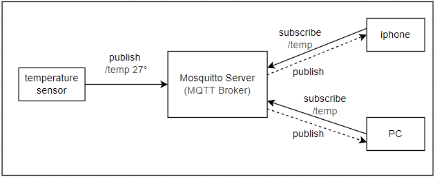
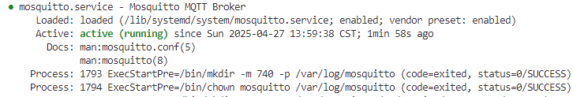
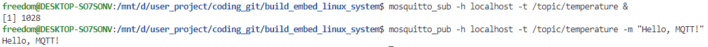
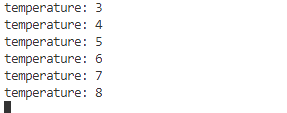

# mqtt组网和客户端应用实现

MQTT，全称（Message Queuing Telemetry Transport）是一种轻量级、基于发布-订阅模式的消息传输协议。适用于资源受限的设备和低带宽、高延迟或不稳定的网络环境。因此常用于物联网、工业自动化、车联网和能源管理等领域。

MQTT具有以下特点:

1. 轻量级：MQTT 协议的报文格式简单，头部开销小，这使得它在资源受限的设备上也能轻松运行，减少了设备的处理负担和网络带宽的占用。
2. 发布-订阅模式：MQTT 协议支持发布-订阅模式，即多个客户端可以订阅同一个主题，当有消息发布到该主题时，所有订阅该主题的客户端都会收到该消息。解耦了消息的发送者和接收者，提高了灵活性
3. Qos支持：MQTT 协议支持三种 QoS（Quality of Service）级别，分别是 0、1 和 2，用于确保消息的可靠传输。
4. 保持活动机制： MQTT 协议支持保持活动机制，即当客户端断开连接后，服务器会保留该客户端的订阅关系和消息，当客户端重新连接时，服务器会将该客户端的订阅关系和消息重新发送给该客户端。
5. 支持多种传输协议：MQTT 协议支持多种传输协议，如 TCP/IP、WebSocket 等，使得 MQTT 协议在多种网络环境中都能很好的运行。

本文以应用为主干，结合MQTT协议的特点，内容目录如下所示。

- [mqtt工作原理](#mqtt_work)
- [mqtt broker服务器](#mqtt_broker)
- [基于cpp实现mqtt client](#mqtt_client_cpp)
- [基于python实现mqtt client](#mqtt_client_python)
- [总结说明](#summary)
- [下一章节](#next_chapter)

## mqtt_work

MQTT是基于发布-订阅模式的通信协议，由MQTT客户端通过主题（Topic）发布或订阅消息，通过MQTT Broker集中管理消息路由，并依据预设的服务质量等级(QoS)确保端到端消息传递可靠性；其中各部分说明如下。

- MQTT客户端；任何运行MQTT客户端库的应用或设备都是MQTT客户端。例如，使用MQTT的即时通讯应用是客户端，使用MQTT上报数据的各种传感器是客户端，各种MQTT测试工具也是客户端。

- MQTT Broker；MQTT Broker 是负责处理客户端请求的关键组件，包括建立连接、断开连接、订阅和取消订阅等操作，同时还负责消息的转发。一个高效强大的 MQTT Broker 能够轻松应对海量连接和百万级消息吞吐量，从而帮助物联网服务提供商专注于业务发展，快速构建可靠的MQTT应用。常见的MQTT Broker如下所示。
  - EMQX：EMQX是一个开源的、高性能的MQTT Broker，支持多种协议，如MQTT、MQTT-SN、CoAP等。
  - Mosquitto：Mosquitto是一个轻量级的开源MQTT Broker，支持多种协议，如MQTT、MQTT-SN、CoAP等。
  - HiveMQ：HiveMQ是一个功能强大的MQTT Broker，支持多种协议，如MQTT、MQTT-SN、CoAP等。
  - OPEN MQ: OPEN MQ是一个开源的、高性能的MQTT Broker，支持多种协议，如MQTT、MQTT-SN、CoAP等。

- 主题（Topic）：MQTT 协议中的一个重要概念，用于标识消息的目的地。客户端可以订阅一个或多个主题，当有消息发布到这些主题时，所有订阅该主题的客户端都会收到该消息。主题通常由多个层级组成，用“/”分隔，例如“/topic/temp”表示温度主题。

- Qos: MQTT 提供了三种服务质量（QoS），在不同网络环境下保证消息的可靠性。
  - QoS 0：消息最多传送一次。如果当前客户端不可用，它将丢失这条消息。
  - QoS 1：消息至少传送一次。
  - QoS 2：消息只传送一次。

另一个关键信息就发布-订阅模式，它解耦了消息的发送者（发布者）和接收者（订阅者）；发布者和订阅者之间无需建立直接连接，而是通过MQTT Broker来负责消息的路由和分发；这里展示基于Mosquitto的MQTT的通讯框架典型应用实现。



由上图可知，MQTT的工作流程如下所示。

1. 客户端使用MQTT框架与MQTT-Broker建立连接，可以选择使用 TLS/SSL 加密来实现安全通信。客户端提供认证信息，并指定会话类型（Clean Session 或 Persistent Session）。
2. 客户端既可以向特定主题发布消息，也可以订阅主题以接收消息。当客户端发布消息时，它会将消息发送给 MQTT Broker；而当客户端订阅消息时，它会接收与订阅主题相关的消息。
3. MQTT Broker 接收发布的消息，并将这些消息转发给订阅了对应主题的客户端。它根据 QoS 等级确保消息可靠传递，并根据会话类型为断开连接的客户端存储消息。

下面开始从应用角度来介绍MQTT的实现。

## mqtt_broker

对于mqtt的应用，第一步是构建mqtt broker，这里使用mosquitto，在ubuntu系统下安装mosquitto，命令如下所示。

```shell
# 安装mosquitto服务器
sudo apt-get install mosquitto mosquitto-clients
```

安装完成后，启动mosquitto，命令如下所示。

```shell
# 启动mosquitto服务器
sudo systemctl start mosquitto
```

启动完成后，查看mosquitto的状态，命令如下所示。

```shell
# 查看mosquitto服务器状态
sudo systemctl status mosquitto
```



由上图可知，mosquitto服务器已经启动成功。

当然对于嵌入式系统平台，需要交叉编译mosquitto源码来实现；这一步参考如下步骤: 

- [交叉编译mosquitto源码](./ch01-04.linux_cross_compiler.md#mosquitto_cross_compiler)

下一步就是构建mqtt客户端，这里有多种方案；可以使用python的paho-mqtt库，也可以使用C/C++，基于mosquitto的库来实现mqtt应用；这里分别进行说明。

## mqtt_client_cpp

mqtt客户端基于C/C++实现时，首先系统要支持MQTT的库，对于桌面端平台，通过如下安装。

```shell
# 安装mosquitto库
sudo apt-get install libmosquitto-dev libmosquittopp-dev
```

安装完成后，使用-lmosquitto、-lmosquittopp即可链接编译mqtt客户端，具体实现如下所示。

```c
typedef struct
{
    std::string id;
    std::string host;
    int port;
    std::string sub_topic;
    int keepalive{60};
    int qos{1};
}mqtt_info;

using mosqpp::mosquittopp;

class mqtt_device : public mosquittopp
{
public:
    /// \brief constructor
    /// \param info -- info used to initialize the mqtt service.
    mqtt_device(const mqtt_info &info, std::function<void(char *ptr, int size)> handler)
    :mosquittopp(info.id.c_str()) {
        info_ = info;
        func_handler_ = handler;
        memset(buffer_, 0, sizeof(buffer_));
    }

    /// \brief destructor
    ~mqtt_device() {
    };

    /// \brief on_connect
    /// - 处理mqtt连接时的回调，在此处订阅主题。
    /// \param rc -- state for mqtt connect, 0 is success.
    void on_connect(int rc) {

        std::cout << "Connected with broker, state: " << rc << std::endl;
        if (rc == 0) {
            /* Only attempt to subscribe on a successful connect. */
            if (!info_.sub_topic.empty()) {
                subscribe(NULL, info_.sub_topic.c_str(), info_.qos);
            } else {
                std::cout << "Sub topic is empty." << std::endl;
            }
            
            is_connet_ = true;
        }
    }

    /// \brief on_message
    /// - This method is used do mqtt message receive
    /// \param message -- memssage when receive from subscribe topic
    void on_message(const struct mosquitto_message *message) {
        if (!strcmp(message->topic, info_.sub_topic.c_str())) {
            /* Copy N-1 bytes to ensure always 0 terminated. */
            memcpy(buffer_, message->payload, message->payloadlen);
            buffer_[message->payloadlen] = '\0';
            if (func_handler_) {
                func_handler_(buffer_, message->payloadlen);
            }
        }
    }

    /// \brief on_subscribe
    /// - This method is used do subscribe success.
    /// \param mid -- message id
    /// \param qos_count -- qos计数
    /// \param granted_qos -- qos数组
    void on_subscribe(int mid, int qos_count, const int *granted_qos) {
        std::cout << "Subscribe succeeded." << std::endl;
    }

    /// \brief publish_msg
    /// - This method is publish msg str.
    /// \param str -- memssage when receive by subscribe
    /// \return publish msg process.
    int publish_msg(const std::string &topic, int qos, const char* ptr, int size) {
        int ret = -1;

        if (is_connet_ && size > 0) {
            if (!topic.empty()) {
                ret = publish(NULL, topic.c_str(), size, ptr, qos);
            } else {
                std::cout << "topic is empty." << std::endl;
            }
        }
        
        return ret;
    }

    /// \brief start
    /// - This method is used to start mqtt process.
    bool start() {
        thread_ = std::thread(std::bind(&mqtt_device::mqtt_run, this));
        thread_.detach();

        return true;
    }
private:
    /// \brief mqtt_run
    /// - mqtt loop run thread.
    void mqtt_run() {
        mosqpp::lib_init();

        std::cout << "mqtt run..." << std::endl;
        
        connect(info_.host.c_str(), info_.port, info_.keepalive);
    
        while (1) {
            loop_forever();
        }
    
        mosqpp::lib_cleanup();
    }

private:
    /// \brief info_
    /// - info used to store mqtt config.
    mqtt_info info_;

    /// \brief is_connet_
    /// - wheather mqtt success connect.
    bool is_connet_{false};

    /// \brief thread_
    /// - mqtt run thread object.
    std::thread thread_;

    /// \brief buffer_
    /// - buffer store subscription information.
    char buffer_[512];

    /// \brief buffer_
    /// - buffer store subscription information.
    std::function<void(char *ptr, int size)> func_handler_;
};
```

在应用中，使用如下代码即可实现mqtt的创建，订阅和发布。

```c
int main(int argc, char *argv[])
{
    mqtt_info mqtt_process_info = {
        id: "mqtt_node0",
        host: "172.27.83.254",
        port:1883,
        sub_topic:"/topic/node0",
        keepalive:60,
        qos:1
    };
    uint32_t temp = 0;
    std::string temp_str;;

    std::shared_ptr<mqtt_device> mqtt_client = std::make_shared<mqtt_device>(mqtt_process_info, [](char *ptr, int size) {
        std::cout << "recv msg: " << ptr << std::endl;
    });

    // 启动mqtt服务
    mqtt_client->start();

    while(1) {
        temp++;
        if (temp > 100) {
            temp = 0;
        }
        temp_str = std::to_string(temp);

        //周期性的提交数据
        mqtt_client->publish_msg("/topic/temperature", 1, temp_str.c_str(), temp_str.size());
        std::this_thread::sleep_for(std::chrono::seconds(3));
    }

    return 0;
}
```

可以使用mqtt_clients来测试数据是否正常，命令如下所示。

```shell
# 使用mosquitto获取mqtt服务
mosquitto_sub -h localhost -t /topic/temperature
```



由上图可知，mqtt客户端已经正常运行。

本节例程详见如下所示。

- [mqtt客户端节点0实现](./file/ch04-12/mqtt_node_0/)
- [mqtt客户端节点1实现](./file/ch04-12/mqtt_node_1/)

## mqtt_client_python

mqtt python客户端基于paho-mqtt库实现，首先安装paho-mqtt库，命令如下所示。

```shell
pip3 install paho.mqtt -i https://pypi.tuna.tsinghua.edu.cn/simple/
```

安装完成后，使用如下代码即可实现mqtt的创建，订阅和发布。

```python
import paho.mqtt.client as mqtt
import time

mqtt_client = mqtt.Client()

# 连接成功回调
def on_connect(client, userdata, flags, rc):
    if rc == 0:
        print("Connected with result code " + str(rc))
        # 连接成功后订阅主题
        client.subscribe("/topic/temperature")
    else:
        print(f"Failed to connect, return code {rc}")

# 接收到消息回调
def on_message(client, userdata, msg):
    print(f"Received message on topic '{msg.topic}': {msg.payload.decode()}")

mqtt_client.on_connect = on_connect
mqtt_client.on_message = on_message

broker_address = "localhost"
broker_port = 1883
mqtt_client.connect(broker_address, broker_port)

mqtt_client.loop_start()

try:
    while True:
        # 发送消息
        mqtt_client.publish("test/topic", "Hello, World!")
        time.sleep(5)
except KeyboardInterrupt:
    print("Disconnecting from MQTT broker...")
    mqtt_client.loop_stop()
    mqtt_client.disconnect()
```

使用如下命令执行。

```shell
python3 mqtt_client.py
```

执行结果如下所示。



详细代码可见： [mqtt_client.py](./file/ch04-12/mqtt_paho/mqtt_client.py)

## summary

至此，关于mqtt相关内容初步介绍完毕；本文围绕 MQTT（Message Queuing Telemetry Transport）展开，详细介绍其概念、特点、工作机制，以及在不同环境下构建 MQTT Broker 和客户端的方法。不过在实践中还要根据需求组合数据，根据网络环境来选择合适的协议和Qos质量，以应对更复杂的应用场景。

## next_chapter

[返回目录](../README.md)

直接开始下一节说明: [综合应用开发](./ch04-13.modbus.md)
