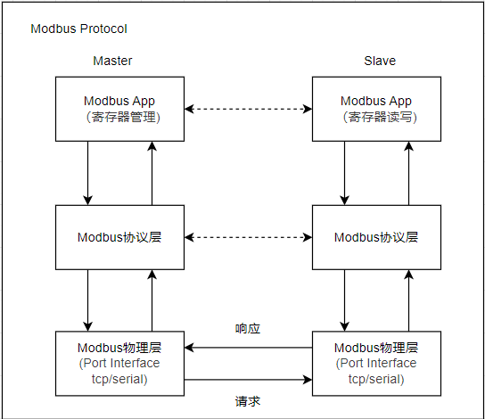

# modbus应用开发实现

Modbus协议是由Modicon开发的，用于工业自动化系统中的通讯协议，Modbus支持串行通讯(RS232, RS485)和以太网通讯。Modbus协议已经成为一个开放的标准，具有简单易懂、灵活性强、易于扩展、开放性和可靠性高等特点。广泛应用于工业自动化控制、智能家居、能源监控、环境监测和智能交通等领域。

Modbus协议根据通讯方式的划分，主要包含如下两大类。

1. 以RTU或ASCII模式进行传输的串行通讯方式，以UART相关的接口TTL, RS232, RS485为主，也支持其它介质如CAN，SPI等。在这个模式下，主要为一主多从的通讯框架。主站作为发起方，负责发送请求信息并接收从站的回应(Modbus-Master)；从站则响应主站的请求，提供数据或执行相应的操作。串行通讯模式下，包含一个主站和至少一个从站，不同从站之间通过地址域来区分。
2. 以TCP模式进行传输的以太网通讯方式，此时系统采用客户端/服务器模式；此时认为客户端就是主站，服务端作为从站，也支持一主多从的通讯框架。

可以看到，modbus的协议部分有RTU，ASCII，TCP三种模式组成，其中RTU和ASCII都是基于串行通讯方式，TCP则是基于网络服务的一主多从结构。另外从角色上来说，Modbus协议也分为主机和从机两部分实现；主机可以是主站也可以是从站，从机则只能是从站。这里关于主机的实现基于libmodbus库实现，从机则是基于freemodbus库实现。

- 主机libmodbus库下载地址: <https://github.com/stephane/libmodbus>
- 主从机freemodbus库下载地址: <https://github.com/armink/FreeModbus_Slave-Master-RTT-STM32>

本节目录如下所示。

- [modbus协议](#modbus_protocol)
- [modbus从机实现](#modbus_slave)
  - [modbus从机应用层实现](#modbus_app_regs)
  - [modbus从机串口接口实现](#modbus_serial)
  - [modbus从机TCP接口实现](#modbus_tcp)
- [modbus主机实现](#modbus_master)
  - [pymodbus主机单元测试代码](#pymodbus)
  - [libmodbus主机单元测试代码](#libmodbus)
- [总结说明](#summary)
- [下一章节](#next_chapter)

另外本节也附带相关的代码。

- [基于freemodbus的从机移植实现](./file/ch04-13/modbus_s/)
- [基于libmodbus的主机移植实现](./file/ch04-13/modbus_m/)
- [基于pymodbus的单元测试代码](./file/ch04-13/modbus_s/unittest/unit_test.py)

## modbus_protocol

Modbus通讯根据硬件接口不同分为TCP和串行模式，其中串行模式又根据传输格式的不同，有RTU和ASCII两种。看起来很复杂，但具体到软件执行框架和流程是基础一致的。如何解析协议呢，这里参考我曾经的经验。协议是约定了多个设备之间交互的方法，为了保证能够正常的数据通讯，能够处理各类问题；因此定义一些约束，符合约束的设备才能够互相联系，这些约束包含如下所示。

1. 物理层，通俗的就是硬件连接方法，包含连接的线缆，物理通讯接口，电平和驱动配置；其中串行通讯，就涉及串口波特率，数据位，停止位，奇偶校验位，底层的接收和发送接口的实现；而TCP通讯，则将整个TCP协议抽象成接口，就转换成ip地址，端口后，读写和发送接口的实现；至于更近一步的网络协议信息，则可以通过网络协议的学习来理解，降低复杂度
2. 协议层，协议解析和组包发送方法，其中协议解析主要接收对端数据，解析处理，并将解析后信息提交到应用层，协议组包则是将应用层的数据添加协议信息，组包到物理层发送
3. 应用层，处理具体的应用功能，包含业务的数据信息，处理提交和发送业务

按照这个思路，modbus协议的主从机通讯格式如下。



完整的通讯流程包含主机发送请求步骤和从机响应应答步骤，具体如下。

发送请求步骤如下。

1. 主机发起请求，通知协议层发送指定请求
2. 协议层根据请求，组包生成数据包，并调用物理层处理
3. 物理层将数据包通过port硬件接口发送到从机
4. 从机接收到完整数据包，提交到协议层处理
5. 协议层解析数据包，执行相应的业务功能，最终到达从机应用层
6. 从机应用层处理业务，完成后执行响应动作

响应应答步骤如下。

1. 从机应用层处理业务，完成后执行响应动作
2. 从机应用层将处理结果提交到协议层
3. 协议层根据应用层结果，组包生成数据包，并调用物理层处理
4. 物理层将数据包通过port硬件接口发送到主机
5. 主机接收到完整数据包，提交到协议层处理
6. 协议层解析数据包，执行相应的业务处理，一次通讯结束

可以看到，一次完整的通讯是包含主/从机两部分处理，从流程来说是基本一致的，只是在处理的顺序和数据流向上有区别。

对于协议的理解，最主要是协议如何组包和解包的处理，这部分根据协议文档解析；对于modbus协议，其中modbus串口和modbus TCP的格式有差异；这里分别以modbus RTU和Mobdus TCP来说明。

Modbus RTU的协议格式如下所示。

| 地址域 | 功能码 | 数据域 | 校验域 |
| --- | --- | --- | --- |
| 1字节 | 1字节 | n字节 | 2字节 |

- 地址域：标识要访问的设备，用于适配一主多从设备的通讯架构，每个从机有独立的地址值
- 功能码：表示要执行的操作，如读取保持寄存器、写入单个寄存器等
- 数据域：包含特定功能的参数或数据，根据数据域决定不同的数据格式
- 校验码: 用于确保数据传输的准确性，如CRC循环冗余校验。

其中Modbus的功能码支持如下所示。

| 功能码 | 功能说明 |
| --- | --- |
| 0x01 | 读线圈状态 |
| 0x02 | 读取离散输入(只读) |
| 0x03 | 读取保持寄存器 |
| 0x04 | 读取输入寄存器(只读) |
| 0x05 | 写单个线圈 |
| 0x06 | 写单个保持寄存器 |
| 0x0F | 写多个线圈 |
| 0x10 | 写多个保持寄存器 |

上面协议格式还好理解，反而功能码在刚开始接触时比较迷惑，这里面线圈，离散，保存，输入寄存器是什么意思，为什么这么命名？其实这是和工业类的需求息息相关的。在工业领域中，类似继电器，LED，蜂鸣器，都是由开关量控制(ON表示打开，OFF表示关闭)，这类设备可以通过单个bit控制，统一归纳为线圈管理(coils)。还有一类设备，如传感器，限位开关信号，只有输入开关量，使用只读的离散输入管理。保持寄存器是16位的寄存器，用于存储可读写的数据，通常是模拟量，比如温度、压力、速度等；输入寄存器也是16位寄存器，主要用于存储从外部设备采集到的模拟量数据，比如传感器的测量值。指令根据处理寄存器分类如下所示。

| 寄存器 | 功能码 |
| --- | --- |
| 线圈 | 0x01, 0x05, 0x0F |
| 离散输入 | 0x02 |
| 保持寄存器 | 0x03, 0x06, 0x10 |
| 输入寄存器 | 0x04 |

对于Modbus TCP协议，其格式如下所示。

| Transaction Identifier | Protocol Identifier | Length | Unit Identifier | Function Code | Data |
| --- | --- | --- | --- | --- | --- |
| 事务处理标识符 | 协议标识符 | 长度 | 单元标识符 | 功能码 | 数据域 |
| 2 字节 | 2 字节 | 2 字节 | 1 字节 | 1 字节 | n 字节 |

- 事务处理标识符: 用于匹配请求和响应消息
- 协议标识符: 标识Modbus应用协议
- 长度: 指示后续数据单元的长度
- 单元标识符: 从设备的地址，用于区分不同的从设备(类似于上面的地址域)
- 功能码: 指示操作类型，如读、写等，其中功能码和Modbus RTU一致
- 数据域: 根据功能码的不同，数据部分可能包含地址、数量等信息

其中功能码和数据域就是和Modbus RTU相同的部分，这里不在说明。讲解完协议，下面进行modbus协议的移植。

## modbus_slave

modbus_slave实现包含两部分，分为Modbus Serial和Modbus TCP物理层实现。其中协议层主要实现协议部分解析组包的部分，这部分由freemodbus实现。对于用户来说，主要实现两部分，应用层处理寄存器的实现和物理层的操作。

### modbus_app_regs

modbus应用层部分则是通用的，主要定义相应的寄存器，并提供读写的处理，这里按照寄存器进行分类处理。

- 线圈寄存器，按位操作，可读写

```c
/*
CRC校验: 高位在前, 低位在后

功能码: 01(0x01), 读线圈状态，读取连续的值(每个寄存器代表1bit数据)，可读可写
#define MB_FUNC_READ_COILS                    ( 1 )
eMBException eMBFuncReadCoils( UCHAR * pucFrame, USHORT * usLen )
RTU请求:  | 01 | 01 | 00 00 | 00 08 | 3d cc | => | 从设备地址 | 功能码 | 寄存器首地址,实际+1 | 寄存器长度 | CRC校验 |
从机响应: | 01 | 01 | 01 | 10 | 50 44 | => | 从设备地址 | 功能码 | 数据个数 | 寄存器内数据 | CRC校验 |

功能码: 05(0x05), 写单个线圈(0xFF 0x00表示1, 0x00 0x00为0, 其它则错误)
#define MB_FUNC_WRITE_SINGLE_COIL             (  5 )
eMBException eMBFuncWriteCoil( UCHAR * pucFrame, USHORT * usLen )
RTU请求:  | 01 | 05 | 00 01 | FF 00 | dd fa | => | 从设备地址 | 功能码 | 寄存器首地址 | 变更数据 | CRC校验 |
从机响应: | 01 | 05 | 00 01 | FF 00 | dd fa | => | 从设备地址 | 功能码 | 寄存器首地址 | 变更数据 | CRC校验 |

功能码: 15(0x0F), 写多个线圈
#define MB_FUNC_WRITE_MULTIPLE_COILS          ( 15 )
eMBException eMBFuncWriteMultipleCoils( UCHAR * pucFrame, USHORT * usLen )
RTU请求:  | 01 | 0F | 00 00 | 00 04 | 01 | 0x0F | 7f 5e | => | 从设备地址 | 功能码 | 寄存器首地址 | 线圈数目 | 写入字节个数 | 写入字节 | CRC校验 |
从机响应: | 01 | 0F | 00 00 | 00 04 | 54 08 |             => | 从设备地址 | 功能码 | 寄存器首地址 | 线圈数目 | CRC校验 |
*/
#define REG_COIL_START           0x0001
#define REG_COIL_NREGS           48
static UCHAR  usRegCoilBuf[REG_COIL_NREGS/8] = {0x10, 0xf2, 0x35, 0x00, 0x00, 0x00};

eMBErrorCode eMBRegCoilsCB( UCHAR * pucRegBuffer, USHORT usAddress, USHORT usNCoils, eMBRegisterMode eMode )
{
    UCHAR *pucStartRegBuffer;
    USHORT usRegIndex;
    USHORT usCoilnums;

    // 检查寄存器范围是否满足要求
    if (usAddress < REG_COIL_START
    || usAddress + usNCoils > REG_COIL_START+REG_COIL_NREGS) {
        return MB_ENOREG;
    } 
    
    usRegIndex = usAddress - REG_COIL_START;
    usCoilnums = usNCoils;
    pucStartRegBuffer = pucRegBuffer;

    switch (eMode) {
        case MB_REG_WRITE: //写入bit，每次写入8bit，不足写入剩余bit
            while( usCoilnums > 0 ) {
                xMBUtilSetBits( usRegCoilBuf, usRegIndex, (uint8_t)( usCoilnums > 8 ? 8 : usCoilnums ), *pucStartRegBuffer++ );
                if (usCoilnums > 8) {
                    usCoilnums -= 8;
                    usRegIndex += 8;
                } else {
                    break;
                }
            }
            coil_hardware_process(usRegCoilBuf, usAddress, usNCoils);
            break;
        case MB_REG_READ: //读取bit，每次读取8bit，不足8bit剩余位用0填充
            while( usCoilnums > 0 ) {
                *pucStartRegBuffer++ = xMBUtilGetBits(usRegCoilBuf, usRegIndex, ( uint8_t )( usCoilnums > 8 ? 8 : usCoilnums ) );
                if (usCoilnums > 8) {
                    usCoilnums -= 8;
                    usRegIndex += 8;
                } else {
                    break;
                }
            }
            break;
    }
    return MB_ENOERR;
}
```

- 离散输入寄存器, 按位操作，只读

```c
/*
功能码: 02(0x02), 读取离散输入(每个寄存器代表1bit数据)，只读
#define MB_FUNC_READ_DISCRETE_INPUTS          (  2 )
eMBException eMBFuncReadDiscreteInputs( UCHAR * pucFrame, USHORT * usLen )调用eMBRegDiscreteCB
RTU请求:  | 01 | 02 | 00 00 | 00 04 | 25 3a | => | 从设备地址 | 功能码 | 离散寄存器地址 | 离散寄存器长度 | CRC校验 |
从机响应: | 01 | 02 | 01 | 03 | 2a 1c | => | 从设备地址 | 功能码 | 数据个数 | 寄存器内数据 | CRC校验 |
*/
*/
#define REG_DISCRETE_START           0x0001
#define REG_DISCRETE_NREGS           48
static UCHAR   usRegDiscreateBuf[REG_DISCRETE_NREGS/8] = {0x34, 0x56, 0x78, 0x9a, 0xbc, 0xde};  
eMBErrorCode eMBRegDiscreteCB( UCHAR * pucRegBuffer, USHORT usAddress, USHORT usNDiscrete )
{
    eMBErrorCode eStatus = MB_ENOERR;
    USHORT usRegIndex;

    // 检查寄存器范围是否满足要求
    if (usAddress < REG_COIL_START
    || (usAddress + usNDiscrete > REG_COIL_START+REG_COIL_NREGS)) {
        return MB_ENOREG;
    }
    
    usRegIndex = usAddress - REG_COIL_START;

    // 读取离散输入寄存器值，每次读取8bit，不足8bit剩余位用0填充
    while( usNDiscrete > 0 ) {
        *pucRegBuffer++ = xMBUtilGetBits(usRegDiscreateBuf, usRegIndex, (uint8_t)( usNDiscrete > 8 ? 8 : usNDiscrete ) );
        if(usNDiscrete > 8) {
            usNDiscrete -= 8;
            usRegIndex += 8;
        } else {
            break;
        }
    }

    return eStatus;    
}
```

- 保持寄存器, 按双字节操作，可读写

```c
/*
功能码: 03(0x03), 读取保持寄存器((每个寄存器代表16bit数据)
#define MB_FUNC_READ_DISCRETE_INPUTS          (  2 )
eMBException eMBFuncReadDiscreteInputs( UCHAR * pucFrame, USHORT * usLen )eMBRegHoldingCB
RTU请求:  | 01 | 03 | 00 00 | 00 02 | 25 3a | => | 从设备地址 | 功能码 | 保持寄存器地址 | 保持寄存器长度 | CRC校验 |
从机响应: | 01 | 03 | 02 | 0x10 0x00 | 2a 1c | => | 从设备地址 | 功能码 | 数据个数 | 寄存器内数据 | CRC校验 |

功能码: 06(0x06), 写入保持寄存器((每个寄存器代表16bit数据)
#define MB_FUNC_WRITE_REGISTER                (  6 )
eMBException eMBFuncWriteHoldingRegister( UCHAR * pucFrame, USHORT * usLen )
RTU请求:  | 01 | 06 | 00 00 | 00 0A | 25 3a | => | 从设备地址 | 功能码 | 保持寄存器地址 | 保持寄存器数据 | CRC校验 |
从机响应: | 01 | 06 | 00 00 | 00 0A | 25 3a | => | 从设备地址 | 功能码 | 数据个数 | 寄存器内数据 | CRC校验 |

*/
#define REG_HOLDING_START           0x0001
#define REG_HOLDING_NREGS           10
static USHORT   usRegHoldingStart = REG_HOLDING_START;
static USHORT   usRegHoldingBuf[REG_HOLDING_NREGS] = {0x0001, 0x0002, 0x0003, 0x0004, 0x0005, 0x0006, 0x0007, 0x0008, 0x0009, 0x000A};
eMBErrorCode
eMBRegHoldingCB( UCHAR * pucRegBuffer, USHORT usAddress, USHORT usNRegs, eMBRegisterMode eMode )
{
    eMBErrorCode    eStatus = MB_ENOERR;
    int             iRegIndex;

    // 检查寄存器范围是否满足要求
    if((usAddress < REG_HOLDING_START) 
    || ((usAddress+usNRegs) > (REG_HOLDING_START + REG_HOLDING_NREGS))) {
        
        return MB_ENOREG;   
    }

    iRegIndex = (int)(usAddress - usRegHoldingStart);
    switch (eMode) {                                       
        case MB_REG_READ: //读取寄存器双字节
            while (usNRegs > 0) {
                *pucRegBuffer++ = (usRegHoldingBuf[iRegIndex] >> 8);            
                *pucRegBuffer++ = (usRegHoldingBuf[iRegIndex] & 0xFF); 
                iRegIndex++;
                usNRegs--;
            }                            
            break;
        case MB_REG_WRITE: //写入寄存器双字节
            while(usNRegs > 0) {         
                usRegHoldingBuf[iRegIndex] = *pucRegBuffer++ << 8;
                usRegHoldingBuf[iRegIndex] |= *pucRegBuffer++;
                iRegIndex++;
                usNRegs--;
            }
        break;
    }

    return eStatus;
}
```

- 输入寄存器, 按双字节操作，只读

```c
/*
功能码: 04, 读取输入寄存器(每个数据2字节)

#define MB_FUNC_READ_INPUT_REGISTER          (  4 )
eMBException eMBFuncReadInputRegister( UCHAR * pucFrame, USHORT * usLen )eMBRegInputCB

RTU请求:  | 01 | 04 | 00 00 | 00 02 | 25 3a | => | 从设备地址 | 功能码 | 离散寄存器地址 | 离散寄存器长度 | CRC校验 |
从机响应: | 01 | 04 | 02 | 0x10 0x00 0x10 0x01 | 2a 1c | => | 从设备地址 | 功能码 | 数据个数 | 寄存器内数据 | CRC校验 |
*/
#define REG_INPUT_START           0x0001
#define REG_INPUT_NREGS           10
static USHORT   usRegInputStart = REG_INPUT_START;
static USHORT   usRegInputBuf[REG_INPUT_NREGS] = {0x1000, 0x1001, 0x1002, 0x1003};

eMBErrorCode
eMBRegInputCB( UCHAR * pucRegBuffer, USHORT usAddress, USHORT usNRegs )
{
    eMBErrorCode    eStatus = MB_ENOERR;
    int             iRegIndex;

    // 检查寄存器范围是否满足要求
    if(usAddress < REG_INPUT_START
    || (usAddress + usNRegs > REG_INPUT_START + REG_INPUT_NREGS)) {
        return MB_ENOREG;
    }

    iRegIndex = ( int )( usAddress - usRegInputStart );

    // 读取输入寄存器值双字节
    while (usNRegs > 0) {
        *pucRegBuffer++ = ( unsigned char )( usRegInputBuf[iRegIndex] >> 8 );
        *pucRegBuffer++ = ( unsigned char )( usRegInputBuf[iRegIndex] & 0xFF );
        iRegIndex++;
        usNRegs--;
    }

    return eStatus;
}
```

至此，关于应用层寄存器的处理代码实现完毕，剩余就是初始化协议和执行的代码，这部分可以由线程来处理，具体如下。

```c
// modbus slave初始化和使能实现
static eMBErrorCode modbus_initialize(void)
{
    eMBErrorCode eStatus = MB_EINVAL;

#if MODBUS_RUN_MODE == MODBUS_RUN_RTU
    eStatus = eMBInit( MB_RTU, MODBUS_DEF_ADDRESS, 0, MODBUS_DEF_UBAUD, MODBUS_DEF_PARITY );    // RTU模式初始化
#elif MODBUS_RUN_MODE == MODBUS_RUN_ASCII
    eStatus = eMBInit( MB_ASCII, MODBUS_DEF_ADDRESS, 0, MODBUS_DEF_UBAUD, MODBUS_DEF_PARITY );  // ASCII模式初始化
#elif MODBUS_RUN_MODE == MODBUS_RUN_TCP
    eStatus = eMBTCPInit( MODBUS_DEF_TCP_PORT );                                                // TCP模式初始化
#endif
    if ( eStatus != MB_ENOERR ) {
        LOG_ERROR(0, "modbus init failed, error code: {}", static_cast<int>(eStatus));
        return eStatus;
    }
    eStatus = eMBEnable(  );
    if ( eStatus!= MB_ENOERR ){
        LOG_ERROR(0, "modbus enable failed, error code: {}", static_cast<int>(eStatus));
        return eStatus;
    }
    
    return eStatus;
}

int main(int argc, char *argv[])
{
    logger_manage::get_instance()->set_log_level(logger_manage::LOGGER_LEVEL::INFO);

    //modbus initialize.
    if ( modbus_initialize() != MB_ENOERR ) {
        LOG_ERROR(0, "modbus initialize failed");
        exit(-1);
    }

    for(;;)
    {
        ( void )eMBPoll(  );
        
    }    
}
```

应用层的实现包含寄存器处理，协议初始化、使能和轮询控制，理解了这些就掌握了modbus从机协议层的管理。modbus物理层包含modbus serial接口(RTU、ASCII共用)和modbus tcp接口；其对完整包处理，数据接收的格式都不同，是独立的处理，这里首先以串口接口为例。

### modbus_serial

根据上面的modbus rtu协议格式，可以看到并没有帧头，帧尾，长度等字段表示完整帧；那么依靠什么来判断呢？实验过单片机空闲中断原理的可以知道，当串口开始收发，一段时间没有收到数据，就认为一次接收结束。串口接口也是类似，接收到数据时，重启定时器，当定时器超时，就认为一次接收结束；至于发送则比较简单，直接调用串口发送接口即可实现；整个移植包含串口收发接口，超时定时器处理；在Linux端因为上层以文件流的方式读取数据，因此以线程的方式控制读写，具体移植内容如下所示。

- 定时器超时接口(port/porttimer.cpp)

```c
// 定时器超时处理
void vTimerCallback(int sig) 
{
    EnterCriticalSection();
    pxMBPortCBTimerExpired();
    ExitCriticalSection();
}

//初始化定时器，定义超时回调函数
BOOL xMBPortTimersInit( USHORT usTim1Timerout50us )
{
    signal(SIGALRM, vTimerCallback);
    return TRUE;
}

//使能定时器
void vMBPortTimersEnable( void )
{
    struct itimerval tick;

    tick.it_value.tv_sec = 0;
    tick.it_value.tv_usec = 200;
 
    //After first, the Interval time for clock
    tick.it_interval.tv_sec = 0;
    tick.it_interval.tv_usec = 0;

    setitimer(ITIMER_REAL, &tick, NULL);
}

//关闭定时器
void vMBPortTimersDisable( void )
{
    struct itimerval value;
    value.it_value.tv_sec = 0;  
    value.it_value.tv_usec = 0;  
    value.it_interval.tv_sec = 0;
    value.it_interval.tv_usec = 0;

    setitimer(ITIMER_REAL, &value, NULL); 
}
```

这部分使用系统定时器实现，当然也可以使用rtc，或者注册用定时器的方式来实现都可以。实现逻辑为每次收到定时器时，就重启定时器；当定时器超时时，表示完整一帧数据，此时通知主循环进行协议解析处理，这部分在pxMBPortCBTimerExpired中实现。

- 串口收发接口(port/portserial.cpp)

发送接口处理如下。

```c
/* ----------------------- Start implementation -----------------------------*/
void vMBPortSerialEnable( BOOL xRxEnable, BOOL xTxEnable )
{  
    if (xTxEnable) {
        portserial.tx_buffer_size = 0;
        portserial.tx_semaphore.signal();       //通知发送线程，开始数据发送
    } 

    if (xRxEnable) {
        portserial.rx_buffer_size = 0; 
    }
}

void
vMBPortClose( void )
{
}

// 发送接口，pxMBFrameCBTransmitterEmpty => xMBPortSerialPutByte
// 将数据写入到发送buffer中
static BOOL
prvvUARTTxReadyISR( void )
{
    return pxMBFrameCBTransmitterEmpty( );
}

BOOL xMBPortSerialPutByte( UCHAR ucByte )
{
    portserial.tx_buffer[portserial.tx_buffer_size++] = ucByte;
    return TRUE;
}

void port_tty_tx_thread(void)
{
    while (1) {
        if( portserial.tx_semaphore.wait(TIME_ACTION_ALWAYS) ) {
            while (!prvvUARTTxReadyISR()) {  //调用xMBPortSerialPutByte，将数据写入缓存中    
            }
#if PORT_RUN_MODE == PORT_SERIAL_MODE
            portserial.tty.write(portserial.tx_buffer, portserial.tx_buffer_size);
#else
            LOG_INFO(0, "fifo_point_ tx:{}", portserial.tx_buffer_size);
            portserial.fifo_point_->write(portserial.tx_buffer, portserial.tx_buffer_size);
#endif
        }
    }
}
```

接收接口处理如下。

```c
static void
prvvUARTRxISR( void )
{
    pxMBFrameCBByteReceived(  );
}

// 从串口读取数据
BOOL xMBPortSerialGetByte( CHAR * pucByte )
{
    *pucByte = portserial.rx_buffer[portserial.rx_buffer_size++];
    return TRUE;
}

void port_tty_rx_thread(void)
{
    ssize_t n_size;

    while (1) {
#if PORT_RUN_MODE == PORT_SERIAL_MODE
        n_size = portserial.tty.read(portserial.rx_buffer, RX_BUFFER_SIZE);     //串口读取数据，写入到缓存portserial.rx_buffer中
#else
        n_size = portserial.fifo_point_->read(portserial.rx_buffer, RX_BUFFER_SIZE);
#endif
        if (n_size > 0) {
            portserial.rx_buffer_size = 0;
            for (int index=0; index<n_size; index++) {
                prvvUARTRxISR();                                               //取出缓存数据，写入到modbus协议中
            }
        } else if ( n_size == 0) {
            continue;
        } else {
        }
    }
}
```

另外还有所有模式下共享的事件队列(port/portevent.cpp)，用于告知eMBPoll处理对应事件；完整代码如下所示。

```c
/* ----------------------- Variables ----------------------------------------*/
static EVENT::Thread_Queue<eMBEventType> queue;

/* ----------------------- Start implementation -----------------------------*/
BOOL
xMBPortEventInit( void )
{
    return TRUE;
}

// 发送事件
BOOL
xMBPortEventPost( eMBEventType eEvent )
{
    queue.send(eEvent);
    return TRUE;
}

// 接收事件
BOOL
xMBPortEventGet( eMBEventType * eEvent )
{
    BOOL            xEventHappened = FALSE;
    eMBEventType event;

    if( queue.receive(event, TIME_ACTION_ALWAYS) )
    {
        *eEvent = event;
        xEventHappened = TRUE;
    }
    return xEventHappened;
}
```

支持modbus serial协议相关的接口实现完毕，参考代码如下。

- [serial接口处理](./file/ch04-13/modbus_s/port/portserial.cpp)
- [定时器处理](./file/ch04-13/modbus_s/port/porttimer.cpp)
- [事件队列处理](./file/ch04-13/modbus_s/port/portevent.cpp)

### modbus_tcp

modbus tcp协议和serial不同，定义包含数据长度，在接口层可以检测完整帧，然后再投递到应用层；其它部分则一致，主要实现收发接口，具体包含如下步骤。

- socket服务器创建

```c
void mb_tcp_process_task(USHORT port)
{
    struct sockaddr_in server_addr;
    struct sockaddr_in client_addr;
    socklen_t client_addr_len;
    int opt = 1;
    int server_fd;

    server_fd = socket(AF_INET, SOCK_STREAM, 0);
    if (server_fd == -1) {
        LOG_ERROR(0, "can't create socket\n");
        return;
    }

    setsockopt(server_fd, SOL_SOCKET, SO_REUSEADDR, &opt, sizeof(opt));

    // 定义服务器地址结构
    memset(&server_addr, 0, sizeof(server_addr));
    server_addr.sin_family = AF_INET;
    server_addr.sin_addr.s_addr = htonl(INADDR_ANY);
    server_addr.sin_port = htons(port);

    do {
        if (bind(server_fd, (struct sockaddr *)&server_addr, sizeof(server_addr)) < 0) {      
            printf("socket server bind error:%d\n", port);
            sleep(5);
            continue;     
        } else {
            printf("bind ok, net_port:%d\n", port);
            break;
        }
    }while(1);

    // 监听socket
    listen(server_fd, 1);

    LOG_INFO(0, "server listen success, fd:{}, port:{}", server_fd, port);

    while (1) {
        client_addr_len = sizeof(client_addr);
        porttcp_info.client_fd = accept(server_fd, (struct sockaddr*)&client_addr, &client_addr_len);
        if (porttcp_info.client_fd < 0) {
            LOG_WARN(0, "client accept failed!");
            continue;
        }

        LOG_INFO(0, "client connect success!");
        tcp_rx_process(porttcp_info.client_fd);
    }
}
```

- socket接收完整帧处理

```c
static void tcp_rx_process(int client_fd)
{
    porttcp_info.rx_frame_size = 0;

    while (1) {
        porttcp_info.rx_size = recv(client_fd, porttcp_info.rx_buffer, TCP_RX_BUFFER_SIZE, 0);
        if (porttcp_info.rx_size < 0) {
            break;
        } else if (porttcp_info.rx_size == 0) {
            break;
        } else {
            //小于范围才进行拷贝
            if (porttcp_info.rx_frame_size + porttcp_info.rx_size < TCP_RX_BUFFER_SIZE) {
                memcpy(&porttcp_info.rx_frame_buffer[porttcp_info.rx_frame_size], porttcp_info.rx_buffer, porttcp_info.rx_size);
            } else { // 超出范围则直接丢弃
                LOG_ERROR(0, "rx_frame_size:{} > rx_size:{}", porttcp_info.rx_frame_size, porttcp_info.rx_size);
                porttcp_info.rx_frame_size = 0;
                continue; 
            }
            porttcp_info.rx_frame_size += porttcp_info.rx_size;

            // 判断完整帧
            if (porttcp_info.rx_frame_size >= 6) {
                uint16_t len = porttcp_info.rx_frame_buffer[4]*256 + porttcp_info.rx_frame_buffer[5] + 6;

                // 长度过长, 数据丢弃
                if (len > TCP_RX_BUFFER_SIZE) {
                    LOG_ERROR(0, "rx_frame_size:{} > TCP_RX_BUFFER_SIZE:{}", len, TCP_RX_BUFFER_SIZE);
                    porttcp_info.rx_frame_size = 0;
                    continue;;
                }

                if (porttcp_info.rx_frame_size >= len) {
                    xMBPortEventPost(EV_FRAME_RECEIVED);
                }
            }
        }
    }

    printf("client disconnect!\n");
    close(client_fd);
    client_fd = -1;
}

// 获取缓存的tcp接收数据帧，提交到应用层
BOOL
xMBTCPPortGetRequest(UCHAR **ppucMBTCPFrame, USHORT *usTCPLength)
{
    *ppucMBTCPFrame = &porttcp_info.rx_frame_buffer[0];
    *usTCPLength = porttcp_info.rx_frame_size;
    porttcp_info.rx_frame_size = 0;
    return TRUE;
}
```

- socket发送数据

```c
// 调用socket发送接口，响应应答帧
BOOL
xMBTCPPortSendResponse(const UCHAR *pucMBTCPFrame, USHORT usTCPLength)
{
    int ret;
    BOOL bFrameSent = FALSE;

    if (porttcp_info.client_fd >= 0)
    {
        ret = send(porttcp_info.client_fd, (void *)pucMBTCPFrame, usTCPLength, 0);
        if (ret == usTCPLength)
        {
            bFrameSent = TRUE;
        }
    }
    return bFrameSent;
}
```

至此关于从机的modbus tcp的代码实现完毕，详细参考代码。

- [modbus tcp接口处理](./file/ch04-13/modbus_s/port/porttcp.cpp)

下面开始modbus主机的实现说明，这里主要以modbus tcp协议为例，其他协议实现方式类似。

## modbus_master

modbus主机从功能上来说，就实现符合协议格式的组包，发送到从机；接收从机返回，然后解析出数据，进行相应的应用层处理。本篇中以pymodbus和libmodbus为例，讲解modbus主机实现。

### pymodbus

pymodbus是python中至此modbus的协议库，可以十分方便进行modbus主机的开发；以modbus tcp为例，主要内容如下所示。

step 1: 安装pymodbus库

```shell
# 使用pip3安装pymodbus库
pip3 install pymodbus

# Ubuntu可以使用apt安装pymodbus库
sudo apt install python3-pymodbus
```

step 2: 使用pymodbus进行modbus主机开发

```python
# 初始化modbus连接接口
client = ModbusClient(SOCK_IPADDRESS, port=SOCK_PORT)
connection = client.connect()

# 读写coils寄存器
# 写入多个bit对应coils寄存器
response = client.write_coils(address=0, values=hex_to_bool_list(usRegCoilBuf, 48))
# 读取多个bit对应coils寄存器
response = client.read_coils(address=0, count=4)
# 写入单个bit对应的coil寄存器
response = client.write_coil(address=0, value=True)

# 读取离散寄存器(只读)
response = client.read_discrete_inputs(address=0, count=16)

# 读写保持寄存器
response = client.write_registers(address=0, values=usRegHoldingBuf)
response = client.read_holding_registers(address=0, count=4)

# 读取输入寄存器(只读)
respone = client.read_input_registers(address=0, count=5)
```

详细代码可以参考如下。

- [pymodbus示例测试代码](./file/ch04-13/modbus_s/unittest/unit_test.py)

### libmodbus

libmodbus是c语言的modbus协议库，可以方便的进行modbus主机的开发；以modbus tcp为例，主要内容如下所示。

step 1: 安装libmodbus库

```shell
# 安装libmodbus库
sudo apt-get install libmodbus-dev
```

step 2: 使用libmodbus进行modbus主机开发

```c
// 初始化modbus连接接口
modbus_t *ctx = modbus_new_tcp(MODBUS_TCP_IP, MODBUS_TCP_PORT);
if (!ctx) {
    fprintf(stderr, "Failed to create TCP context\n");
    return -1;
}

if (modbus_set_slave(ctx, MODBUS_TCP_UNIT_ID) == -1) {
    fprintf(stderr, "Failed to set slave ID\n");
    modbus_free(ctx);
    return -1;
}

if (modbus_connect(ctx) == -1) {
    fprintf(stderr, "Connection failed: %s\n", modbus_strerror(errno));
    modbus_free(ctx);
    return -1;
}

// 读写coils寄存器
modbus_write_bits(ctx, 0, 48, bitBuffer);
int rc = modbus_read_bits(ctx, 0, 4, usRegCoilReadBuf);

// 读取离散寄存器(只读)
int rc = modbus_read_input_bits(ctx, 0, 16, usRegDiscreateReadBuf)

// 读写保持寄存器
modbus_write_registers(ctx, 0, 10, usRegHoldingBuf);
int rc = modbus_read_registers(ctx, 0, 10, usRegHoldingReadBuf);

// 读取输入寄存器(只读)
int rc = modbus_read_input_registers(ctx, 0, 5, usRegInputReadBuf);
```

读取数据后，进行相应的处理，就实现了libmodbus主机功能；相应的代码可以参考如下。

- [libmodbus示例测试代码](./file/ch04-13/libmodbus_m/main.cpp)

## summary

至此，关于Modbus主从机的讲解完成。本文主要以协议为基础，freemodbus的移植和应用，libmodbus和pymodbus为核心，讲解modbus需要了解的知识。不过因为篇幅原因，只能抛砖引玉，如果希望彻底掌握modbus协议，还需要自己去移植，调试验证，才能有更深入的了解。

## next_chapter

[返回目录](../README.md)

直接开始下一节说明: [基于v4l2的摄像头开发](./ch04-14.v4l2_opencv.md)
