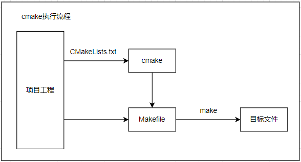

# cmake构建Linux软件项目

在软件开发过程中，构建系统是不可或缺的一部分，它负责将源代码转换为可执行文件或库。在前面开发中使用的Makefile文件，就是一种常用的构建系统。不过Makefile也有缺陷，处理复杂的依赖关系和跨平台编译时需要手动编写大量的代码实现，CMake正是为了解决这些问题才诞生的。CMake作为一个跨平台的开源构建系统生成器，被广泛应用于各种项目中。它使用简单的脚本语言来描述项目的构建过程，能够生成多种平台和编译器的构建文件，如Makefile、Microsoft Visual Studio项目文件等。

本节目录如下。

- [cmake语法说明](#grammar)
- [cmake基本操作方法](#cmake_project_base)
- [cmake高级操作方法](#cmake_project_advance)
- [总结说明](#summary)
- [下一章节](#next_chapter)

以生成Makefile为例，CMake的工作流程如下所示。



可以看到，cmake的功能就是将CMakeLists.txt文件转换成格式化的Makefile文件，之后就可以可以使用make命令来编译项目。对于用户来说，使用cmake的方式就变成如下所示。

1. 在项目目录下创建CMakeLists.txt文件，描述项目的构建规则
2. 在项目中的build目录下执行cmake命令，生成Makefile文件
3. 执行make命令，编译项目

其中使用cmake和make命令比较简单，包含安装和执行两个步骤，具体命令如下所示。

```shell
# 安装cmake和make
sudo apt install cmake make

# 创建build目录
mkdir build
cd build

# 执行cmake命令和make编译
cmake ..
make -j4
```

下面我们重点关注CMakeLists.txt文件的编写，这就涉及cmake语法的了解。

## grammar

CMake语法是使用CMakeLists.txt文件来描述项目的构建规则，CMakeLists.txt文件是一个文本文件，使用简单的脚本语言来描述项目的构建规则，包括项目名称、源文件、头文件、库文件、编译选项等。这听起来并不复杂；只是将Makefile抽象成描述语言，带有需要的信息即可。可是在实践中，通过CMakeLists.txt文件来构建项目，该如何实现仍然面临困难。其中最复杂的就是有CMake语法中包含太多的接口，特别是因为对于老标准接口的兼容，很多时候实现是有多种写法，又进一步增加了复杂度。

既然CMake是用于构建项目的工具，那么肯定从实践来说更加快捷；这里提供一些从简单到复杂需求，可以带着这些问题来学习如何用CMake实现功能。

1. 实现编译cpp单目录单文件，生成可执行文件target(main.cpp => target)
2. 实现编译cpp单目录多文件，使用c++11标准，生成可执行文件target(main.cpp=>target c++11)
3. 实现编译cpp单目录多文件，使用c++11标准，编译支持宏定义DEBUG_PRINT，添加编译选项(-g -O1), 生成可执行文件target(main.cpp=>target c++11 -g -O1 -DDEBUG_PRINT)
4. 实现编译cpp多目录多文件，单CMakeLists.txt，使用c++11标准，头文件访问子目录，生成可执行文件target(main.cpp lib/test1.cpp=>target c++11)
5. 实现编译cpp多目录多文件，子目录独立CMakeLists.txt，使用c++11标准，头文件访问子目录，生成可执行文件target(main.cpp lib/test1.cpp=>target c++11)
6. 实现c和cpp混合编程，c使用c99标准，cpp使用c++11标准，生成可执行文件target(main.cpp test.c=>target c99 c++11)
7. 实现交叉编译，在x86平台编译arm平台的可执行程序target
8. 支持静态库(file1.cpp=>libfile1.a)
9. 支持动态库编译(file2.cpp->libfile2.so)
10. 使用静态库和动态库，同时使用标准库，生成可执行文件target(main.cpp libfile1.a libfile2.so=>target)

上述就是我使用Makefile中比较常见的需求，其它的如条件编译，预处理(执行脚本生成文件，例如图片处理成c文件、配置文件生成文件等)。虽然也会涉及，不过都属于进阶技巧，再实践中根据需求处理，属于shell脚本的工作，这里就不展开了。

当然官方提供了常用接口的文档和功能。

具体参考如下: [CMake语法列表说明](https://cmake.org/cmake/help/latest/manual/cmake-buildsystem.7.html)；

如果整理出来，大概列表如下所示。

| 接口 | 功能 |
| --- | --- |
| add_executable | 生成可执行文件 |
| add_library | 生成库文件(.a/.so) |
| cmake_minimum_required | 设置cmake最低版本 |
| project | 设置项目名称 |
| set | 设置变量 |
| option | 设置内部编译选项, ON/OFF |
| include | 引入文件，将其他文件插入到CMakeLists.txt中 |
| add_subdirectory | 添加子目录，导入子目录的CMakeLists.txt |
| file | 添加文件 |
| message | 打印信息 |
| find_package | 在指的的目录查找数据包 |

新支持的target相关接口。

1. PUBLIC, 表明这些属性既适用于当前目标的构建，也会传递给依赖该目标的其他目标。
2. INTERFACE 表明这些属性只适用于当前目标的使用，不会传递给依赖该目标的其他目标
3. PRIVATE 表明这些属性只适用于当前目标的构建，不会传递给依赖该目标的其他目标

| 接口 | 功能 |
| --- | --- |
| target_compile_definitions | 添加编译宏定义 |
| target_compile_options | 添加编译选项 |
| target_compile_features | 添加编译特性(version 3.1) |
| target_include_directories | 添加头文件目录 |
| target_sources | 添加源文件(version 3.1) |
| target_precompile_headers | 添加预编译头文件(version 3.16) |
| target_link_libraries | 添加库文件 |
| target_link_directories | 添加链接的目录 |
| target_link_options | 添加链接选项 |

当然cmake也定义了一系列的全局参数来表示需要的配置信息，具体如下。

| 全局参数 | 功能 |
| --- | --- |
| CMAKE_BUILD_TYPE  | 设置编译类型，Debug或Release |
| CMAKE_IGNORE_PATH | 设置被find_file()和 find_path()命令忽略的目录列表 |
| CMAKE_INCLUDE_PATH | 设置被find_file()和 find_path()命令查找的目录列表 |
| CMAKE_LIBRARY_PATH | 设置被find_library()命令查找的目录列表 |
| CMAKE_SYSTEM_NAME | 设置目标平台名称 |
| CMAKE_SYSTEM_PROCESSOR | 设置目标平台处理器 |
| CMAKE_C_COMPILER | 设置c编译器路径 |
| CMAKE_CXX_COMPILER | 设置c++编译器路径 |
| CMAKE_CXX_STANDARD | 设置c++标准，11表示C++11标准 |
| CMAKE_CXX_STANDARD_REQUIRED | 设置c++标准是否必须 |
| CMAKE_CXX_EXTENSIONS | 设置c++扩展 |
| CMAKE_C_FLAGS | 设置c编译选项 |
| CMAKE_C_FLAGS_DEBUG | 设置c调试编译选项 |
| CMAKE_C_FLAGS_RELEASE | 设置c发布编译选项 |
| CMAKE_CXX_FLAGS | 设置c++编译选项 |
| CMAKE_CXX_FLAGS_DEBUG | 设置c++调试编译选项 |
| CMAKE_CXX_FLAGS_RELEASE | 设置c++发布编译选项 |
| CMAKE_PREFIX_PATH | 设置库搜索路径，交叉编译时需要 |

描述系统信息的变量。

| 变量 | 功能 |
| --- | --- |
| CMAKE_HOST_SYSTEM_NAME | 当前系统名称 |
| CMAKE_HOST_SYSTEM_PROCESSOR | 当前系统处理器 |
| CMAKE_HOST_SYSTEM | 当前系统信息 |
| CMAKE_CURRENT_SOURCE_DIR | 当前项目根目录 |

另外还有一些基本的知识点。

1. 双引号表示字符串是一个整体，否则空格表示多个参数。"hello world"表示一个字符串，hello world表示两个字符串"hello"和"world"
2. 变量使用${}表示，例如${CMAKE_SOURCE_DIR}表示当前项目的根目录
3. 条件判断使用if语句，例如if(condition)，elseif(condition)，else()，endif()
4. 循环使用foreach语句，例如foreach(var IN LISTS list)，endforeach()

上述就是cmake的主要语法，大致分为处理接口，全局信息和系统信息三部分；理论上了解这些，已经可以满足大部分关于CMake的需求。然而实际上，如果没有Makefile的实践基础，使用cmake其实还是雾里看花，不知道如何下手；这里可以给出一些思路，在下节的实现中可以参考。

cmake最终目的是生成可用的编译工具，如Linux平台的Makefile，那么cmake里面带有的信息就是Makefile需要的信息。对于Makefile编译项目，需要如下信息。

1. 项目名称，最终目的的文件类型，对应project
2. 编译工具，g++、gcc以及交叉编译工具，对应CMAKE_C_COMPILER、CMAKE_CXX_COMPILER
3. 编译涉及的源码文件，*.c、*.cpp，对应target_sources
4. 编译需要的头文件目录，*.h，对应target_include_directories
5. 编译需要的库文件，*.a、*.so, 对应target_link_libraries和target_link_directories
6. 编译选项，-g、-O1、-Wall等, 对应target_compile_options
7. 编译宏定义，-DDEBUG_PRINT, 对应target_compile_definitions
8. 编译依赖的系统头文件，-lpthread，-lstdc++等, 对应target_link_options

上述信息即包含了Makefile需要的信息，以及对应的cmake接口；下面章节就以这些信息来实现cmake编译项目。

## cmake_project_base

### project-1

实现编译cpp单目录单文件，生成可执行文件target(main.cpp => target)；首先单目标文件实现简单，理论上需要信息如下。

1. 项目名称，使用project命令设置
2. 生成可执行文件，使用add_executable命令

```Makefile
# CMakeLists.txt
# 设置 CMake 最低版本要求
cmake_minimum_required(VERSION 3.16)

# 设置项目名称
project(target)

# 生成可执行文件
add_executable(target main.cpp)
```

详细工程可见: [cmake编译项目-1](./file/ch04-x3/project-01/)

### project-2

实现编译cpp单目录多文件，使用c++11标准，生成可执行文件target(main.cpp=>target c++11)。

1. 添加C++编译版本选项，使用set命令修改全局变量

```Makefile
# 添加C++版本要求
set(CMAKE_CXX_STANDARD 11)
set(CMAKE_CXX_STANDARD_REQUIRED True)
set(CMAKE_CXX_EXTENSIONS OFF)
```

详细工程可见: [cmake编译项目-2](./file/ch04-x3/project-02/)

### project-3

实现编译cpp单目录多文件，使用c++11标准，编译支持宏定义DEBUG_PRINT，添加编译选项(-g -O1), 生成可执行文件target(main.cpp=>target c++11 -g -O1 -DDEBUG_PRINT)

```Makefile
# 添加编译选项
## 指定 C++ 标准
set(CMAKE_CXX_STANDARD 11)
set(CMAKE_CXX_STANDARD_REQUIRED True)

set(CMAKE_C_FLAGS "${CMAKE_C_FLAGS} -g -O1")
set(CMAKE_CXX_FLAGS "${CMAKE_CXX_FLAGS} -g -O1")

target_compile_definitions(target PRIVATE DEBUG_MODE DEBUG_SIZE=100)

# 添加可执行文件
add_executable(target)

target_sources(target PRIVATE main.cpp test.cpp)
```

详细工程可见: [cmake编译项目-3](./file/ch04-x3/project-03/)

### project-4

实现编译cpp多目录多文件，单CMakeLists.txt，头文件访问子目录，生成可执行文件target(main.cpp lib/test1.cpp=>target)

```Makefile
# 添加可执行文件
file(GLOB_RECURSE SRC_FILES 
            main.cpp
            lib/*.cpp
)
add_executable(target ${SRC_FILES})

target_include_directories(target PUBLIC lib)
```

详细工程可见: [cmake编译项目-4](./file/ch04-x3/project-04/)

### project-5

实现编译cpp多目录多文件，子目录独立CMakeLists.txt，使用c++11标准，头文件访问子目录，生成可执行文件target(main.cpp lib/test1.cpp=>target)

```Makefile
# 添加可执行文件
# 添加子目录的 CMakeLists.txt
add_subdirectory(lib)

file(GLOB MAIN_SOURCES "${CMAKE_CURRENT_SOURCE_DIR}/*.cpp")

add_executable(target)

target_sources(target PRIVATE ${MAIN_SOURCES} ${LIB_SOURCES})

target_include_directories(target PRIVATE ${INCLUDE_HEADERS})
```

子目录的可执行文件为

```Makefile
# 导入文件
file(GLOB LIB_SOURCES "${CMAKE_CURRENT_SOURCE_DIR}/*.cpp")

# 导入目录
set (INCLUDE_HEADERS "${CMAKE_CURRENT_SOURCE_DIR}/include/")

# 将子CMakeLists.txt的变量导入到主CMakeLists.txt
set(LIB_SOURCES ${LIB_SOURCES} PARENT_SCOPE)
set(INCLUDE_HEADERS ${INCLUDE_HEADERS} PARENT_SCOPE)
```

详细工程可见: [cmake编译项目-5](./file/ch04-x3/project-05/)

### project-6

实现c和cpp混合编程，c使用c99标准，cpp使用c++11标准，生成可执行文件target(main.cpp test.c=>target c99 c++11)

```Makefile
# 指定 C++ 标准
set(CMAKE_CXX_STANDARD 11)
set(CMAKE_CXX_STANDARD_REQUIRED True)
set(CMAKE_C_STANDARD 99)

# 添加可执行文件
add_executable(target)

target_sources(target PRIVATE main.cpp test.c)
```

详细工程可见: [cmake编译项目-6](./file/ch04-x3/project-06/)

### project-7

实现交叉编译，在x86平台编译arm平台的可执行程序target。

```Makefile
# 设置交叉编译工具链和平台
set(CMAKE_SYSTEM_NAME Linux)
set(CMAKE_SYSTEM_PROCESSOR arm)
set(CMAKE_C_COMPILER arm-none-linux-gnueabihf-gcc)
set(CMAKE_CXX_COMPILER arm-none-linux-gnueabihf-g++)
```

详细工程可见: [cmake编译项目-7](./file/ch04-x3/project-07/)

### project-8

支持静态库(file1.cpp=>libfile1.a)

```Makefile
# 创建静态库
add_library(file1 STATIC file1.cpp)
```

详细工程可见: [cmake编译项目-8](./file/ch04-x3/project-08/)

### project-9

支持动态库编译(file2.cpp->libfile2.so)

```Makefile
# 创建动态库
add_library(file2 SHARED file2.cpp)
```

详细工程可见: [cmake编译项目-9](./file/ch04-x3/project-09/)

### project-10

使用静态库和动态库，同时使用标准库，生成可执行文件target(main.cpp libfile1.a libfile2.so=>target)

```Makefile
# 链接动态库目录
target_link_directories(target PRIVATE ${CMAKE_CURRENT_SOURCE_DIR})

# 添加 libpthread 和 libm
target_link_libraries(target PRIVATE pthread m)

# 添加本地动静态库
target_link_libraries(target PRIVATE file1 file2)
```

详细工程可见: [cmake编译项目-10](./file/ch04-x3/project-10/)

## cmake_project_advance

上一节主要进行基础的CMakeLists.txt方案构建，主要是如何构建工程，交叉编译，编译静态库和动态库或者使用。下面我们来介绍一些高级的CMakeLists.txt构建。

### find_package

一般情况下，我们通过target_link_directories命令来指定链接库的目录，target_link_libraries命令来指定链接库的名称；理论上系统库libssl，libcrypto，libpthread，libm等库也可以通过这种方式添加。这种方式简单灵活，不过需要处理的细节比较多，例如链接库的名称，目录，头文件等，也无法自动处理库的版本问题。find_package命令可以解决这个问题，它可以自动查找系统中已经安装的包，并导入到CMakeLists.txt中。不过find_package也依赖于系统中安装的包自带的*.cmake信息，否则无法查找。

CMakeLists.txt的实现代码。

```Makefile
# 设置 CMake 最低版本要求
cmake_minimum_required(VERSION 3.16)

# 设置项目名称
project(target)

# 指定 C++ 标准
set(CMAKE_CXX_STANDARD 17)
set(CMAKE_CXX_STANDARD_REQUIRED True)

# 设置查找库的目录(如果库不在标准目录下，需要指定路径)
set(CMAKE_PREFIX_PATH "library")

# 设置CMake模块路径(find_package查询目录)
set(CMAKE_MODULE_PATH ${CMAKE_MODULE_PATH} "${CMAKE_SOURCE_DIR}/cmake")

# 查找USER_FILES库，和上面目录配合查找cmake/FindUSER_FILES.cmake
find_package(USER_FILES REQUIRED)

if(USER_FILES_FOUND)
    message(STATUS "USER_FILES found: ${FILE_INCLUDE_DIR}, ${FILE_LIBRARIES}")

    add_executable(target main.cpp)

    target_include_directories(target PRIVATE ${FILE_INCLUDE_DIR})

    target_link_libraries(target PRIVATE ${FILE_LIBRARIES})
else()
    message(FATAL_ERROR "USER_FILES not found.")
endif()
```

USER_FILES对应的库cmake/FindUSER_FILES.cmake实现代码。

```Makefile
# 查找 files 头文件
find_path(FILE_INCLUDE_DIR
    NAMES file.hpp
    PATHS /include
    PATH_SUFFIXES USER_FILES
)

# 查找 files 库文件
find_library(FILE1_LIBRARY
    NAMES file1
    PATHS /lib
)

find_library(FILE2_LIBRARY
    NAMES file2
    PATHS /lib
)

# 处理 QUIET 或 REQUIRED 等参数
include(FindPackageHandleStandardArgs)
find_package_handle_standard_args(USER_FILES
    REQUIRED_VARS FILE_INCLUDE_DIR FILE1_LIBRARY FILE2_LIBRARY
)

# 设置导出变量
if(USER_FILES_FOUND)
    set(FILE_INCLUDE_DIR ${FILE_INCLUDE_DIR})
    set(FILE_LIBRARIES ${FILE1_LIBRARY} ${FILE2_LIBRARY})
endif()

# 标记为高级变量，默认隐藏
mark_as_advanced(FILE_INCLUDE_DIR FILE1_LIBRARY FILE1_LIBRARY)
```

详细工程可见：[cmake编译项目-11](./file/ch04-x3/project-11/)

### condition_compiler

条件编译，通过if else语句，可以控制编译的流程，例如根据不同的条件编译不同的代码。

```Makefile
# 满足条件，设置变量
if(USER_FILES_FOUND)
    set(FILE_INCLUDE_DIR ${FILE_INCLUDE_DIR})
    set(FILE_LIBRARIES ${FILE1_LIBRARY} ${FILE2_LIBRARY})
endif()

# 满足条件和不满足条件分别执行
if(USER_FILES_FOUND)
    message(STATUS "USER_FILES found: ${FILE_INCLUDE_DIR}, ${FILE_LIBRARIES}")
     
    # ...
else()
    message(FATAL_ERROR "USER_FILES not found.")
endif()
```

## summary

至此，关于CMake基础功能说明完毕。其通过功能强大且灵活的构建系统生成器，使用简洁的语法描述复杂的项目构建过程。掌握CMake的基础语法和高级语法，能够帮助开发者更好地组织和管理项目，实现跨平台构建。在实际项目中，合理运用CMake可以提高开发效率，减少因构建系统带来的问题。因此学习中一定要以实践为核心，配合语法知识去理解应用，积累经验，提高构建能力；当然使用AI来提升效率也是必不可少的步骤，可以大幅度简化操作，提高效率。

## next_chapter

[返回目录](../README.md)

直接开始下一节说明: [系统结语](./ch05.conclusion.md)
